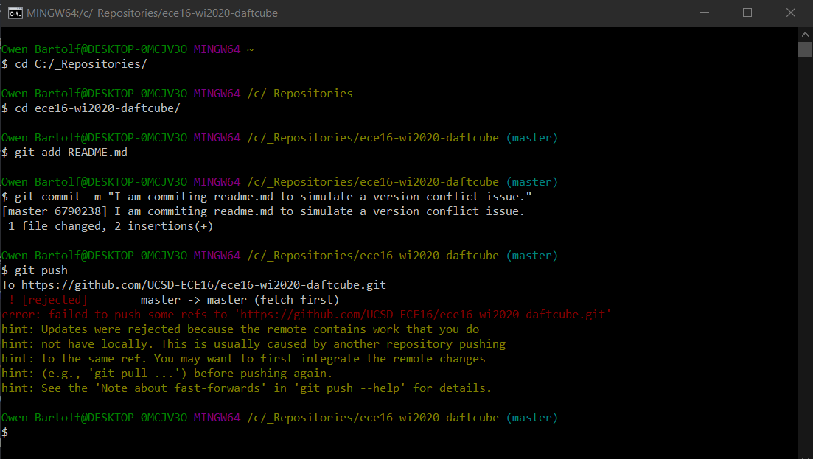
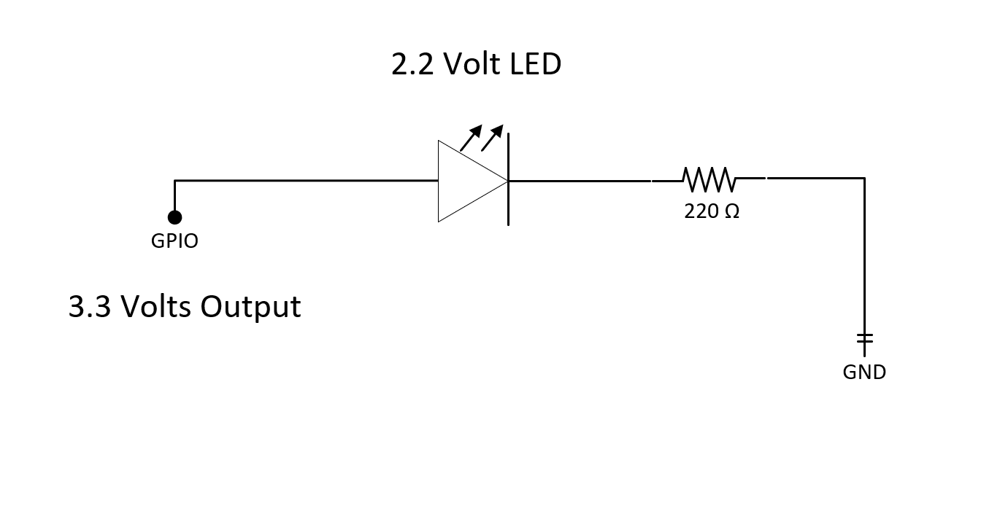
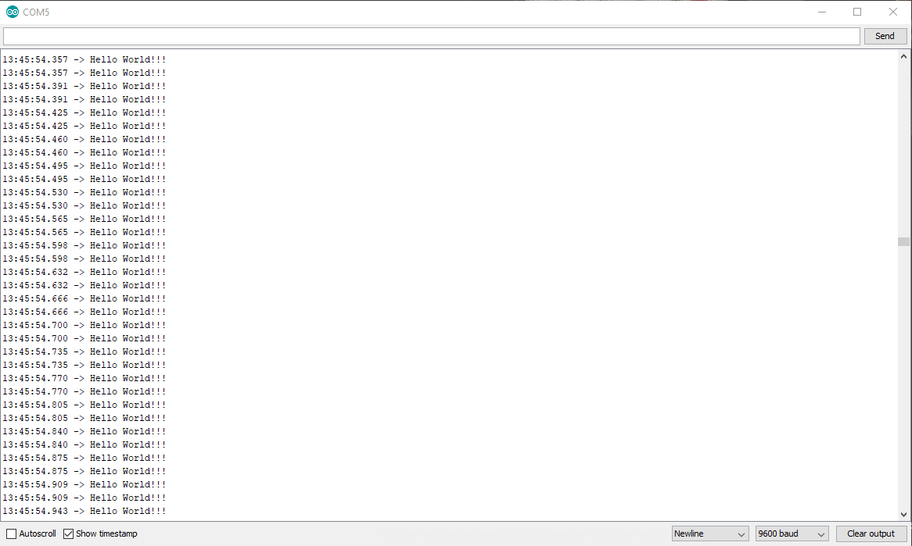

# ECE16 Lab 1 Report
Prepared by: Owen Bartolf

Date: 01/08/2020 (Happy Birthday to Me)

## Tutorials
### Tutorial 1:

> #### Blink
> 
>
> **Q. What is the frequency of the blink rate in this example? Note that frequency is the inverse of the time it takes for a cycle. A cycle is the time it takes to go HIGH to LOW to HIGH again. Record a video of your FireBeetle blinking.  Make a note of the answer for now, in the next GIT tutorial, you will get a copy of a sample lab report.**
>
> A. With our definition of cycle, to get the time it takes for the LED to cycle from HIGH to LOW to HIGH again, we take the sum of all of our 'delay()' function
> arguments. 
> 
> It takes **1000ms + 500ms = 1500ms** to cycle from HIGH to LOW to HIGH again.
> 
> Because we're measuring the frequency of the cycle, and not the period, we will use the formula for frequency to calculate our final result.
> 
> **frequency = cycles per second = 1 / (time in seconds per single cycle)**
> **frequency = 1 / (1.5s)**
> **frequency ~= .667 Hz**
> 
> My previous note has been added to Git.

> **Q. When you open the conflicted readme, what did you get? How did you fix it?**
>
> A.
>
> What we get is this glorious error message. Essentially, we have a version conflict; the current copy of our file
> on our local repository no longer matches the file that lives in the remote repository. We have a few options to fix
> it, including but certainly not limited to...
> 1. Revert the change on the Github website.
> 2. Delete the file on our local machine and pull the newest version to synchronize the versions, then overwrite it and commit the new changes.
> 3. Force a push. **This is the nuclear option and a really really bad idea™.**
> 4. Other methods involving branches and merging.
>
> Personally, I picked option 2, but each method I talked about has its use cases.

### Tutorial 2
> #### Switch
> 
>
> **Q. Why do we need a pull-up resistor? Describe the behavior without it.**
> 
> Todo Answer.
>
> ##### Remarks for Switch Exercise
>
> I used an LED instead of a wire to bridge my button output to my digital read pin. I made this decision because the LED just fit the breadboard better. While it doesn't light up because the 1000 ohm resistor doesn't allow enough current to create a visible amount of light light, it still completes the circuit and allows the charge to flow.
> #### External LED Blink
>
> 
>
> **Q. Which GPIO pin did you have to use according to the above setup?**
>
> According to the diagram, we are using GPIO Pin 26.
>
> **Q. What is the expected current draw?**
>
> 
>
> V = IR 
>
> V = [3.3 Volts Provided] - [2.2 Volt Drop over LED]; 
>
> V = 1.1 Volts
> 
> R = 220 Ω
>
> I = ?
> 
> 1.1 V = 220 Ω * (I)
>
> 1.1 V / 220 Ω = I
>
> I = .005 A
> 
>  **[[ I = 5 mA ]]**
>
> The expected current draw for this circuit is 5 milliamps.
>
> **Q. What is the limit for the GPIO? You can find this on the ESP32_WROOM datasheet.**
>
> According to the datasheet, its either 40 milliamps or 20 milliamps. I don't know how to read it. TODO ask in office hours.
> 
> #### Serial Port Introduction
>
> 
>
> **Q. In your report, run the above code at Baud Rate of 9600. How many seconds are between each Hello World? What did you expect the time between each print statement to be and what did you actually get?** 
>
> According to the code, we expected to see the text, "Hello World!!!" appear on the screen every millisecond. Instead, the serial output looked something like the image above, where we receive two "Hello World!!!" messages at a single timestamp with a 4-5 millisecond delay.
>
> **Q. How does this change when you change the baud rate to 2400, 4800, and 115200. (When you change the baud rate, you’ll also need to change the Serial Monitor’s Baud Rate. The answer to this question should be quantitative and not just qualitative.  Remember that baud rate refers to how many bytes per second is sent. Remember that an ASCII character is 8 bits.**
>
> At the baseline Baud Rate of 9600 bits / second, we received approximately 60 messages every second. There was a minor fluctuation of -1 - +1 messages per second, but was otherwise stable.
>
> The size of "Hello World!!!" is 14 bytes, or 112 bits. So, at the baseline, we should expect 9600 bits / (14 bytes * (8 bits / byte)) ~= 85 messages per second. However, we don't see this result. This leads me to believe that the serial protocol has some amount of protocol overhead. We could even see if we can calculate this overhead using shot-in-the-dark algebra.
> 
> If we receive 60 messages per second, and our baud rate is 9600, we should expect each message to use roughly 9600 bits / 60 messages = 160 bits / message. If we subtract our payload information size (112 bits) from this, we can see that each message has around 48 bits, or six bytes of overhead. However, we made two Serial.print() calls, so that would bring down our overhead to approximately 3 bytes per message call. Of course, this is all estimation; to know for sure, we should have probably consulted the protocol RFC instead.
>
> Moving on, if we decreate the Baud Rate to 4800 bits / second, half of the baseline, we should expect approximately 30 messages given our initial test. And we do get this result, with the same error as before.
>
> If we decrease even further to a rate of 2400 bits / second, we should expect a quarter of the baseline because we will be transferring data at a quarter of the rate.
>
> If we increase to a rate 115200 bits / second, we should expect to receive twelve times the initial information. However, we don't; we only receive around 72 messages per second, with most of them coming in at the same timestampe. This could be because the Serial bus on the board doesn't have enough throughput and is being overwhelmed, or it could be that my machine isn't polling for new packets fast enough. Either way, we see diminishing returns with our current setup. 
>
> And, of course, if we change the baud rate in the Serial Monitor and not the deployed code, we will get some really odd artifacting. This is because the device is broadcasting bytes at a certain rate, while the receiver expects bytes at a faster rate. Thus, the receiver will read either a larger or smaller range of bits than expected. When deserialized back into numbers, the data will yield really large numbers that do not correspond to latin characters on the unicode table.

## Challenges:

### Challenge 0: "Have a Repo with some files in it!"
> ✅✅✅✅✅✅✅✅✅✅✅✅✅✅✅✅✅✅✅✅✅✅✅✅✅✅✅✅✅✅
> Oh wait, here's my required gif!
> 
> [TODO: Insert a gif.]

### Challenge 1: 

>Q. First questions

>A. Your answer and supporting image
>
>To include an image, first include your image in your images folder. 
>

### Challenge 2:
>Q. Second Challenge wants you to have a video!

>A. Answer the question and describe the video.  
>

### Challenge 3:
