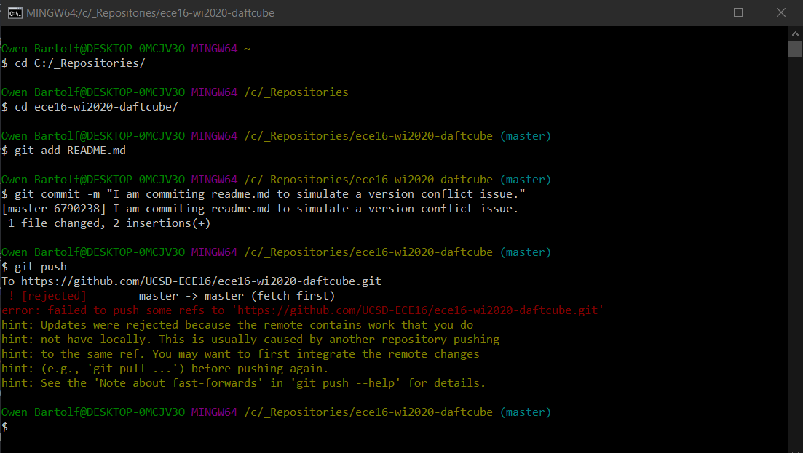
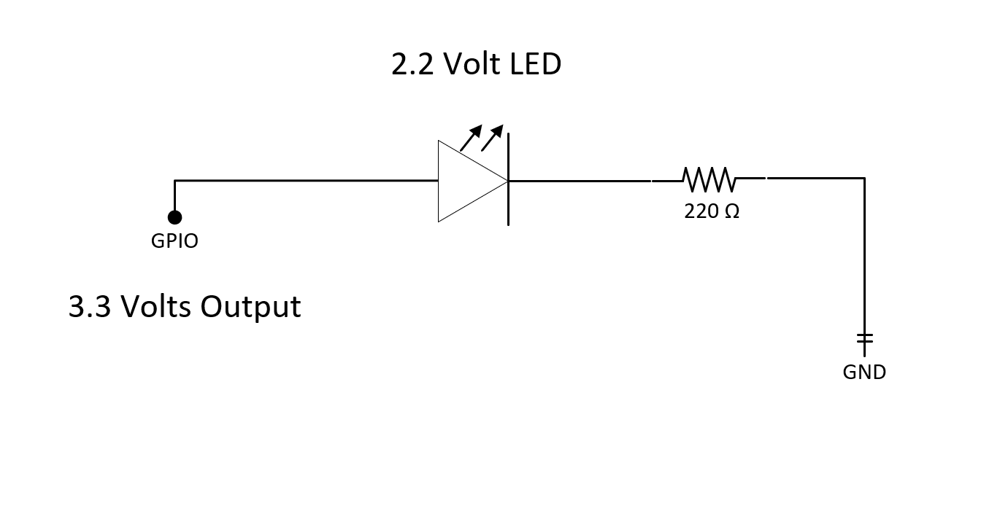
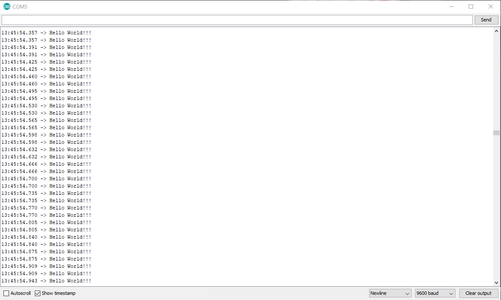
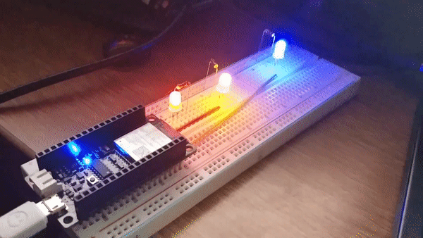
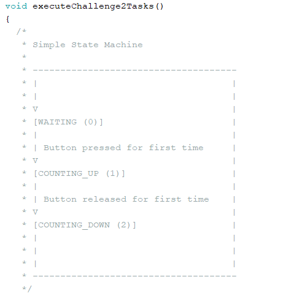

# ECE16 Lab 1 Report
Prepared by: Owen Bartolf

Date: 01/08/2020 (Happy Birthday to Me)

## Tutorials
### Tutorial 1:

> #### Blink
> 
>
> **Q. What is the frequency of the blink rate in this example? Note that frequency is the inverse of the time it takes for a cycle. A cycle is the time it takes to go HIGH to LOW to HIGH again. Record a video of your FireBeetle blinking.  Make a note of the answer for now, in the next GIT tutorial, you will get a copy of a sample lab report.**
>
> A. With our definition of cycle, to get the time it takes for the LED to cycle from HIGH to LOW to HIGH again, we take the sum of all of our 'delay()' function
> arguments. 
> 
> It takes **1000ms + 500ms = 1500ms** to cycle from HIGH to LOW to HIGH again.
> 
> Because we're measuring the frequency of the cycle, and not the period, we will use the formula for frequency to calculate our final result.
> 
> **frequency = cycles per second = 1 / (time in seconds per single cycle)**
> **frequency = 1 / (1.5s)**
> **frequency ~= .667 Hz**
> 
> My previous note has been added to Git.
>
> **Q. When you open the conflicted readme, what did you get? How did you fix it?**
>
> A.
>
> What we get is this glorious error message. Essentially, we have a version conflict; the current copy of our file
> on our local repository no longer matches the file that lives in the remote repository. We have a few options to fix
> it, including but certainly not limited to...
> 1. Revert the change on the Github website.
> 2. Delete the file on our local machine and pull the newest version to synchronize the versions, then overwrite it and commit the new changes.
> 3. Force a push. **This is the nuclear option and a really really bad idea™.**
> 4. Other methods involving branches and merging.
>
> Personally, I picked option 2, but each method I talked about has its use cases.

### Tutorial 2
> #### Switch
> 
>
> **Q. Why do we need a pull-up resistor? Describe the behavior without it.**
> 
> If we just have a switch between a power source and our input pin, we don't always have a complete circuit between them. This means that when the switch is open, we could have a "floating state" where the amount of voltage received by the pin is uncertain.
>
> A pull-up resistor is a means to maintain a closed circuit even when the switch has an open state. When open, a tiny amount of current passes through the resistor and back to ground. When closed, current will flow through the switch to the input pin.
>
> ##### Remarks for Switch Exercise
>
> I used an LED instead of a wire to bridge my button output to my digital read pin. I made this decision because the LED just fit the breadboard better. While it doesn't light up because the 1000 ohm resistor doesn't allow enough current to create a visible amount of light light, it still completes the circuit and allows the charge to flow.
> #### External LED Blink
>
> 
>
> **Q. Which GPIO pin did you have to use according to the above setup?**
>
> According to the diagram, we are using GPIO Pin 26.
>
> **Q. What is the expected current draw?**
>
> 
>
> V = IR 
>
> V = [3.3 Volts Provided] - [2.2 Volt Drop over LED]; 
>
> V = 1.1 Volts
> 
> R = 220 Ω
>
> I = ?
> 
> 1.1 V = 220 Ω * (I)
>
> 1.1 V / 220 Ω = I
>
> I = .005 A
> 
>  **[[ I = 5 mA ]]**
>
> The expected current draw for this circuit is 5 milliamps.
>
> **Q. What is the limit for the GPIO? You can find this on the ESP32_WROOM datasheet.**
>
> According to the datasheet, its either 40 milliamps or 20 milliamps, depending on the power domain.
> 
> #### Serial Port Introduction
>
> 
>
> **Q. In your report, run the above code at Baud Rate of 9600. How many seconds are between each Hello World? What did you expect the time between each print statement to be and what did you actually get?** 
>
> According to the code, we expected to see the text, "Hello World!!!" appear on the screen every millisecond. Instead, the serial output looked something like the image above, where we receive two "Hello World!!!" messages at a single timestamp with a 4-5 millisecond delay.
>
> **Q. How does this change when you change the baud rate to 2400, 4800, and 115200. (When you change the baud rate, you’ll also need to change the Serial Monitor’s Baud Rate. The answer to this question should be quantitative and not just qualitative.  Remember that baud rate refers to how many bytes per second is sent. Remember that an ASCII character is 8 bits.**
>
> At the baseline Baud Rate of 9600 bits / second, we received approximately 60 messages every second. There was a minor fluctuation of -1 - +1 messages per second, but was otherwise stable.
>
> The size of "Hello World!!!" is 14 bytes, or 112 bits. So, at the baseline, we should expect 9600 bits / (14 bytes * (8 bits / byte)) ~= 85 messages per second. However, we don't see this result. This leads me to believe that the serial protocol has some amount of protocol overhead. We could even see if we can calculate this overhead using shot-in-the-dark algebra.
> 
> If we receive 60 messages per second, and our baud rate is 9600, we should expect each message to use roughly 9600 bits / 60 messages = 160 bits / message. If we subtract our payload information size (112 bits) from this, we can see that each message has around 48 bits, or six bytes of overhead. However, we made two Serial.print() calls, so that would bring down our overhead to approximately 3 bytes per message call. Of course, this is all estimation; to know for sure, we should have probably consulted the protocol RFC instead.
>
> Moving on, if we decreate the Baud Rate to 4800 bits / second, half of the baseline, we should expect approximately 30 messages given our initial test. And we do get this result, with the same error as before.
>
> If we decrease even further to a rate of 2400 bits / second, we should expect a quarter of the baseline because we will be transferring data at a quarter of the rate.
>
> If we increase to a rate 115200 bits / second, we should expect to receive twelve times the initial information. However, we don't; we only receive around 72 messages per second, with most of them coming in at the same timestampe. This could be because the Serial bus on the board doesn't have enough throughput and is being overwhelmed, or it could be that my machine isn't polling for new packets fast enough. Either way, we see diminishing returns with our current setup. 
>
> And, of course, if we change the baud rate in the Serial Monitor and not the deployed code, we will get some really odd artifacting. This is because the device is broadcasting bytes at a certain rate, while the receiver expects bytes at a faster rate. Thus, the receiver will read either a larger or smaller range of bits than expected. When deserialized back into numbers, the data will yield really large numbers that do not correspond to latin characters on the unicode table.

## Challenges:

### Challenge 0: "Have a Repo with some files in it!"
> # ✅

### Challenge 1: Blink
>
> **Q. What are the resistor values you chose for each of the LEDs?**
>
> A. Each resistor value depends on the **forward voltage** or **voltage drop** of the LED. This depends on color. I used this chart for my LEDs: (http://dangerousprototypes.com/docs/Basic_Light_Emitting_Diode_guide)
> ##### Red LED
> 
>
> See Tutorial for Red LED.
> ##### Yellow LED 
>
> V = IR 
>
> V = [3.3 Volts Provided] - [2 Volt Drop over LED]; 
>
> V = 1.3 Volts
> 
> R = ? Ω
>
> I = .015 A (Running 5 milliamps below safe maximum of device)
> 
> V / I = R
>
> 1.3 V / .015 A ~= 86.6 Ω
>
> **The closest resistor I could find is 100 Ω**
> ##### Blue LED 
>
> V = IR 
>
> V = [3.3 Volts Provided] - [3 Volt Drop over LED]; 
>
> V = .3 Volts
> 
> R = ? Ω
>
> I = .015 A (Running 5 milliamps below safe maximum of device)
> 
> V / I = R
>
> .3 V / .015 A ~= 20 Ω
>
> **The closest resistor I could find is 100 Ω**
>
> **Q. Videos showing each condition (please record in landscape-horizontal mode)**
>
> 
>
> Here are all of the parts of the challenge running sequentially. You can see the result running above.
>
> 
>
> So, I thought it would be cooler to have all of the LEDs go at the same time. So I did that too. I accomplished this by defining several integer-based timers in an array, and having each condition function have a self-contained timer. The loop runs every millisecond and calls every condition, where the internal timer is incremented. For the onboard LED, it cycles through conditions 1-3. You can see the result above.

### Challenge 2: Timer, Part 1
> 
>
> ##### Opening Preface
> I decided to keep going with my task-based programming pattern that I used in the first challenge. I thought the result was pretty cool, but the resulting code is quite complicated. It might be a good idea to read my response to Challenge 3 before continuing.
>
> **Q. What is the average time elapsed for each second increment? Use millis() to help you with this task. Describe how you measured this.** 
>
> I built a simple bit of benchmarking code to take the time between each second increment. First, in the transition of my start state, I save the current time since startup in milliseconds to a variable using millis. Then, after my the first increment of the internal timer, I take the difference between the current time (using millis) and the previous time I had saved. The difference is the amount of time it took to execute that bit of code.
>
> To run my benchmarking code, type #define BENCHMARK_ENABLED at the top of my code.
>
> In my code, I had an average time of 1000 ms exactly across the board. I took 12 samples, and they were all 1000 ms.
>
> I decided to rewrite the benchmarking code using microseconds instead of milliseconds because I was curious if there was any observable overhead at all. With my microseconds benchmarking test, I was able to observe a 7-9 microsecond overhead. 
> 
### Challenge 3: Timer, Part 2
>
> 
>
> **Q. Describe in plain english the logic of your program.**
>
> Let's start from the top!
>
> Because I wanted to support multiple challenges being executed in parallel, I built a primitive task-based framework. Each challenge is built as a self-contained task. The main loop() function calls every task's loop function sequentially every millisecond. I'm not sure one could call it a primitive task scheduler though.
>
> This organization allows each task to have its own self contained logic that executes in parallel. In exchange, however, tasks may not call blocking functions without suspending the execution of all other tasks. *This means I could not call the delay() function in tasks without potentially breaking other tasks!* 
>
>**Engineering is all about tradeoffs; the assumptions that were made to gain the added benefit of parallelization came with a cost of increased program complexity.** 
>
>While delay() cannot be used, a task can yield by waiting for an incrementing local variable to reach a certain value. This is exactly what I did. 
>
> I implemented the timer as a finite state machine (FSM). Every time loop is called, I use a switch statement to select which logic to run depending on the current state of my FSM. Here is a rundown of each state's behavior:
>
> 
>
> - **Start State**: If the button is pressed, transition to the following state.
> - **Counting Up**: Increments an internal timer by one millisecond. If the timer exceeds 1000 milliseconds, the addTimer() function is called and the internal timer is reset. Within the addTimer() function, the global timer is incremented by one and a message is output through the serial port. If the button is released, the internal timer is reset and the program transitions to the next state.
> - **Counting Down**: Increments an internal timer by one millisecond. If the timer exceeds 200 milliseconds, the removeTimer() function is called, which decrements the global timer by one and sends a message through the serial port. If the global timer is equal to zero, we reset the internal timer and transition back to the start state.
> 
> The finite state machine provides a really good means of organizing program logic, and it allows an easy way to implement a state-dependent, yielding program such as this timer.