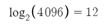
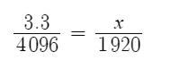
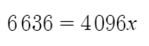
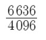
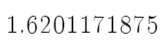
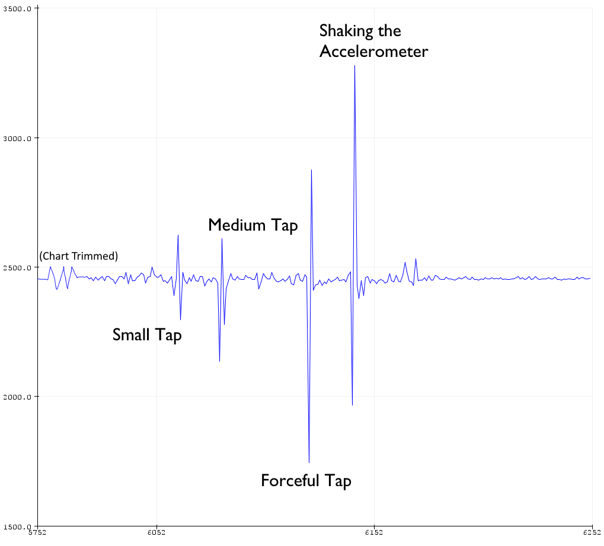
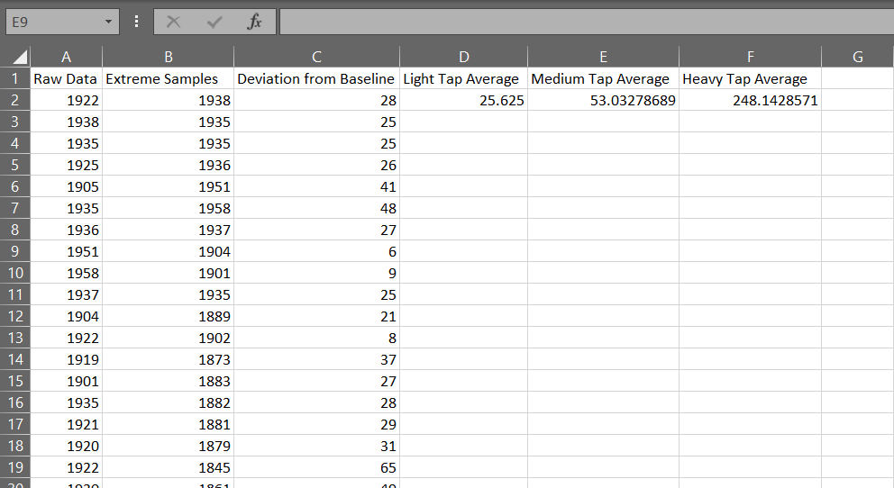
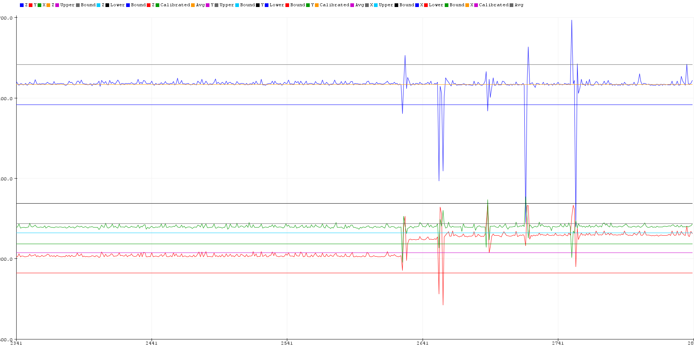
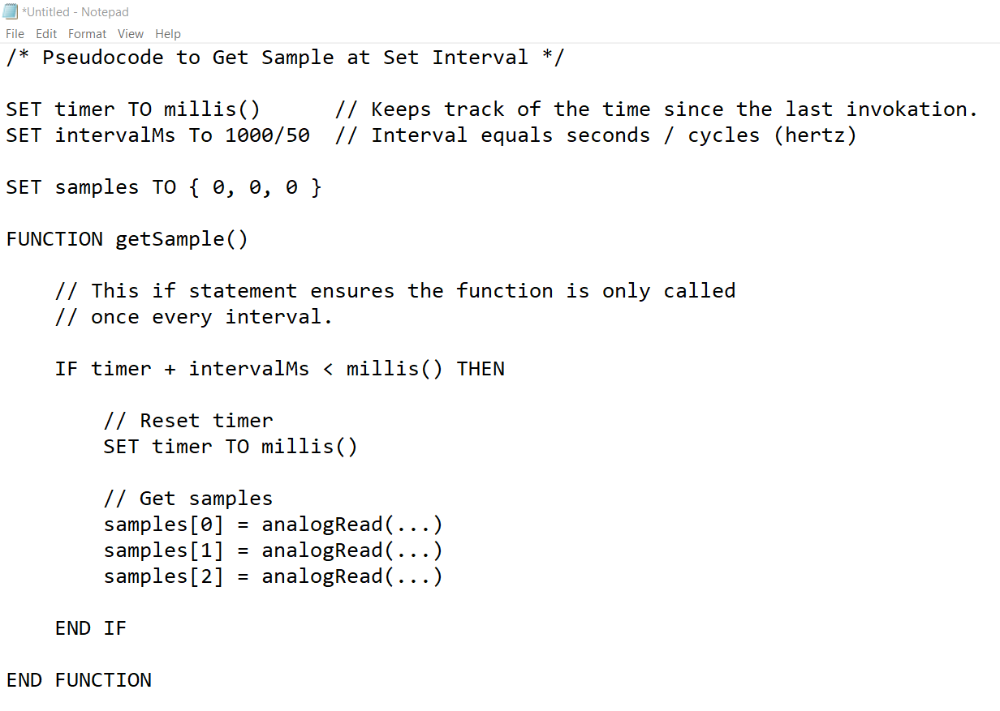

# ECE16 Lab Report 2
Prepared by: Owen Bartolf

Date: 01/16/2020

## Tutorial 1: Accelerometers

> **Q. How many bits is your ADC? Try connecting your A0 pin to 3.3V. How did you calculate the bits?**
> 
> When I connect A0 to 3.3V, the output is 4095. When disconnected, the output is zero. This means there are 4096 possible values. Because our number is composed of bits, which only have two states, we can find the amount of bits needed to compose this number by throwing it in a logarithm with a base of two:
>
> 
>
> **Q. What is the resting value of the accelerometer when it is laying face up. Why is it not 0? What is this value in terms of volts (remember that 3.3V is the maximum).**
> 
> My accelerometer rests at somewhere between 1915 and 1920 when face up.
>
> The accelerometer is not zero because it is constantly detecting the acceleration from the force of gravity.
> 
> Assuming the numerical reading is somewhat proportional to the incoming voltage, we can set up a simple proportion and solve for x:
>
>  
>
> 
>
> 
>
> 
> 
> We are receiving approximately 1.62 volts from the accelerometer.
>
> **Q. Tap the accelerometer light, medium, and hard. What is the average value of each tap? How did you calculate this? Please don’t ask us if you are tapping correctly, use your judgement :) Show a video gif of the accelerometer plotting and tapping at different strengths.**
>
> So, my first approach was to tap it once for each strength... 
>
> 
> 
> However, I quickly realized we are more interested in the _average tap_ because knowing the average tap for each strength would allow us to create a 
>
> To get the average strength of each tap, I used the Serial Monitor to obtain the raw output. Then, I brought the data into a spreadsheeting application.
> 
> I wrote a simple query to remove all 'baseline' values that were determined to be between 1910 and 1930. This left only the extremities, or rather, the taps of various strength. I then divided the samples by the type of tap they were based on the sample's relative position in the list of samples. When recording samples, I tapped in an increasing order of relative strength. Knowing this info, I could easily take the average reading for each strength of tap.
> 
> Each tap has a downward acceleration from the initial press and an upward acceleration as it recovers to its initial position. When moving downward, the reading is less the baseline. When recovering upward, the reading is greater. With an average, these extremes cancel eachother out. Thus, I found it more valuable to take the average of the delta from the resting point rather than the average of the values.
> 
> The average deltas can be found in the below table. The table, in CSV format can be found in [Lab 2's Data Folder](data/Lab2/TapData.csv).
> 
> 
> 
> **Light Tap Average Deviation: 25.625**
>
> **Medium Tap Average Deviation: 53.032**
>
> **Heavy Tap Average Deviation: 248.143**
> 
> And the gif, as requested...
> 
> 

## Tutorial 2: Pulse Width Modulators

> **Q. In the above figure, assuming we are showing 2ms of data, what is the PWM frequency?**
> 
> According to the lab, a cycle is defined as the LED turning on, and then off.
> 
> In the diagram, the LED completes five on/off cycles. These five cycles occur in a two millisecond interval. Using this information, we can plug in the values into the formula for frequency.
>
> frequency = cycles / second
>
> 5 cycles / .002 seconds =
>
> **2500 Hz**
> 
> **Q. Why is 100% duty cycle 255 instead of 256?**
>
> At eight bits of resolution, there are 2^8 = 256 possible values for duty cycle. The maximum numerical value is 255 because zero requires one of those possible values in order to be represented. As zero uses one of the possible values, that means the highest unsigned value must be 255.
> 
> **Q. We purposely made some mistakes in the above example.  What were they? It will not work directly, but by reading the compilation error, the tutorial instructions, and comments carefully, you should have no trouble getting it to work!**
>
> **Syntax**
> - There was a capitalization error on the constant "pwmBitresolution." 
> - The delay functions in loop did not have semicolons.
>
> **Logic**
> - In the loop function, the original code does not turn the LED on or off with PWM. Instead, it tries to bind pin 0 to nonexistent PWM channels. By changing the function to 'ledcWrite,' we actually cycle the LED.

## Tutorial 3: OLED Screens

> **Q. Again we made some intentional mistakes in the code above. What were they?**
>
> **Syntax**
> - Missing semicolon after u8x8.begin()
> - u8x8.print(messages) should be u8x8.print(message)
> - In setup, showMessages(...) should be showMessage(...) 

## Tutorial 4: Serial Read

> **Q. What did the Arduino receive? How does this change if you use different line endings?**
>
> The Arduino receives each character as an encoded byte that coincides with the ASCII Standard Encoding. Within the ASCII Standard, each character is mapped to a particular character on the table. Thus, if we send the string, "Hello, World!" without any endline characters, we get the array...
>
> { 72, 101, 108, 108, 111, 44, 32, 87, 111, 114, 108, 100, 33 }
> 
> If we choose to add an endline character or carriage return character in the Serial Monitor, we get the same buffer but with an additional end byte that represents the invisible character.
>
> If we choose to add both an endline character and a carriage return character, we get the same buffer but with two additional bytes at the end. These represent the two added newline characters.
>
> **Q. What are the Decimal values of NL (new line) and CR (Carriage Return)?**
>
> When I just hit enter in the Serial Monitor with the Newline character option selected, I receive the byte 10. **This means that the decimal value for NL is 10.**
>
> When I just hit enter in the Serial Monitor with the Carriage Return option selected, I receive the byte 13. **This means that the decimal value for CR is 13.**

## Challenge 1: Fading Buzzer
>
> 
>
> **Q. Which pin does the code ask you to use for the motor?**
>
> We use pin 5 for the motor.
> 
> **Q. Why can’t we achieve this speed variation using a digitalWrite and instead has to use ledcWrite?**
> 
> We can't use digitalWrite because digitalWrite only supports a binary signal; the digital pins can only output ~= 3.3 volts in the HIGH state and ~= 0 volts in the LOW state. The ledcWrite family of functions are special because they directly interface with hardware on the MCU to tie the physical pulse-width modulator to the pin, enabling simulated variable states.

## Challenge 2: Gesture Detection

> **Q. What are some different logics you tried and why? What are some situations where you noticed your detection algorithm doesn’t work well?**
>
> At first, I tried to make a fancy system that used arrays to store a history of samples and use the history to generate an upper and lower bound at runtime. This worked to a certain extent, but encountered several issues. Sometimes, the random noise from the sensor would cause the auto-calculated threshold to be too large or small. Next, if taps were made rapidly in succession, the entire system's threshold would extend to encompass the taps and future taps would not be registered for a set period of time.
>
> Of course, there are methods to tune the above system, but I found a raw, manually-set threshold based on the statistical methods I outlined in Tutorial 1 to be pretty bulletproof for most cases. I spent quite a bit of time trying to tune the above system, but at a certain point I couldn't justify spending more time on it when the manually calibrated method just _worked._ **Engineering is all about tradeoffs!**
> 
> For the exact method, checked if the difference between the manually calibrated average and the sample is greater than the threshold for each axis.
>
> Upon further testing, I found an issue where the system would detect multiple duplicate taps for a single tap. To fix this issue, I made a simple "debounce" boolean variable. When true, it causes the detectTap() to resolve as false. I set it to true after the first tap, then set it false once a tap is no longer within the threshold. This prevents duplicate taps from being detected!
>
> For the last part of the question, everything above this point assumes that the accelerometer is more or less level and stationary. When rotated, the force of gravity provides an acceleration on each axis, adjusting the resting value. If we want to not make this assumption, and entire redesign is needed.
>
> **Q. Provide a plot showing 5 taps and the threshold used.** 
>
> 
>
> I also plotted the threshold bounds and the average line on the serial monitor. To accomplish this at any reasonable runtime, I had to crank up the baud rate to 115200.
>
> I used a threshold of +/- 75.
> 
> **Q. Include a video of you tapping on the accelerometer and the OLED counting each time.**
> 
> 

## Challenge 3: Read / Write to OLED

> **Q. Video of a message typed into the serial monitor and appearing on the OLED. This video should be shot WITHOUT moving the camera.**
>
> 
>
> **Q. What happens if you write a really long message? Why?**
>
> Only the start of the message is rendered on the screen. This is because the screen isn't large enough to render all of the text. Internally, the library has a "cursor" that mores to the right as characters are added. With more than a few characters, the cursor falls off the screen and runs out of space to render the message.
>
> We can manage this problem by extending our code to store multiple character buffers and then write a simple "wrap to next line" piece of code. Basically, if the length of the message exceeds the length of the display, the following characters would be rendered on the next line. We wouldn't be able to render an essay on it, but the solution would permit additional length.  
> 
> There is also a chance that, if we send longer than 64 characters, we completely use up the buffer and then get an IndexOutOfBounds error internally. To fix this, we should add an if statement to prevent our buffer from filling beyond index 63.

## Challenge 4: Nonblocking Logic

> Demo of nonblocking logic; both the timer and serial read demo work in parallel:
>
> 
> 
> **Q. As a thought exercise, how might you implement this using BLOCKING logic?** 
>
> Implementing this with blocking logic would be difficult. Essentially, we would have to use the actual flow of the program to maintain our state.
>
> When we are waiting for the first tap, we would enter a while loop that would not exit until the first tap was detected.
>
> Once the first tap was detected, we would enter another blocking loop. We would check for a press, then wait. If a press was detected, we would continue to the next iteration of the loop and iterate the timer variable by 1. We would copy and paste the code three times in the loop, and if it didn't fire by the third time, we would exit the loop to the next part of the program.
>
> The next part is simple: a for loop would decrement the timer variable and delay a single second.
>
> Once we reach zero seconds, the entire body of the loop() function will have only executed once, and we would hop back to the top.
>
> Tap detection would be iffy at best because we would only check once per second. If we wanted to check multiple times, we could use a nested for loop with a small delay. Overall, not a great system.
>
> **Q. How would you use NON-BLOCKING logic to set the sampling rate of the accelerometer to 50Hz? Write a pseudo code.**
>
> Nonblocking delays are all about using the internal clock to keep track of time instead of the delay() function. Because the clock is always running in the background, we can rely on its value to always be up to date when we call the millis() function.
>
> To implement a sample at a set interval, we would create a timer variable to set the time. Then, in the function, we check to see if the current time is greater than/after the time we previously invoked the function plus the desired delay. If true, we run the body of the function, if not, we skip the body. 
>
> Because we call the function every loop, the function will execute almost exactly when the internal timer exceeds our nonblocking delay.
>
> Pseudocode is below!
>
> 
>

## Challenge 5: State Machine

>
> **Q. How many states do you need? Describe in words what each state does and it’s transition logic. Draw the state machine?**
>
> This is just one of many ways this system could be implemented...
> 
> 

## Challenge 6: Gesture-Controlled Watch

>
>
>

## Needless Experiment 0: Fireworks Particle Simulation
>
> 
>
> **Q. Is it impossible to render single pixels on the screen?**
> 
> This whole tangent started when someone put forth the claim that it is impossible to render individual points on the provided OLED screen. Whenever someone says that something isn't possible, I get really curious to see if it is really the case.
> 
> So technically, the screen can't render single pixels. When I was working on this, I learned that the provided OLED screen is divided into 'tiles,' where each tile controls a chunk of LEDs on the screen. But, we can 'fake' the rendering of single pixels by pushing the screen a byte buffer whose binary only has a single '1.' This renders only one pixel on the screen.
>
> So, no, it is technically not possible to render images on the screen pixel-by-pixel. However, yes, we can render individual pixels on the screen via the method I described above.
>
> **Q. Okay, that's great. But, can it actually render something meaningful?**
> 
> I didn't think it was enough to prove my point to just render single pixels. So, I wrote my own graphics library. 
> 
> The library supports the rendering of single pixels and also the rendering of lines between two points. The library only updates tiles on the screen where changes took place, so the refresh rate is actually really high.
>
> As a proof of functionality, I built a particle simulation above my graphics library. It simulates fireworks! Each particle is affected by gravity and is given an initial random velocity at startup. The result is really cool!
>
> The graphics library can be found in my lab 2 repo. It's completely seperate and modular, so feel free to spread the word. I'd love to see others take advantage of the ability to render single points on the screen!
> 
> ## **Q. But why...?**
> 
> This is my coping mechanism for not getting a CS class.