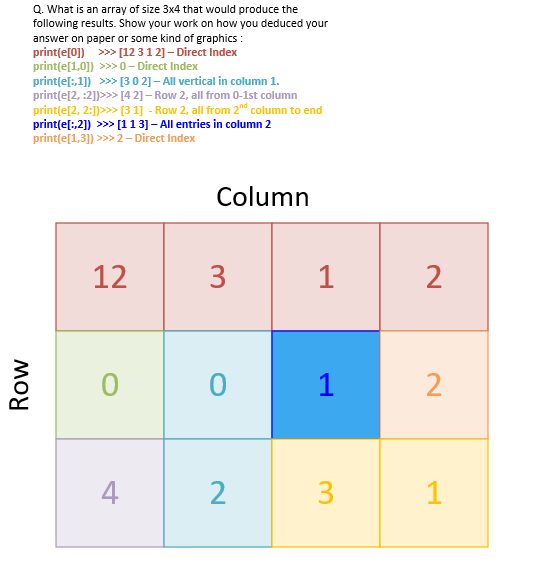
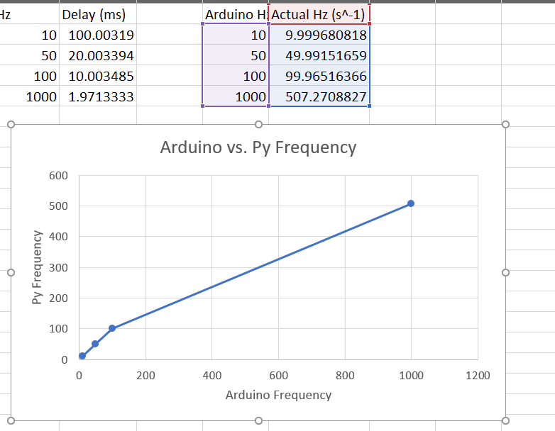
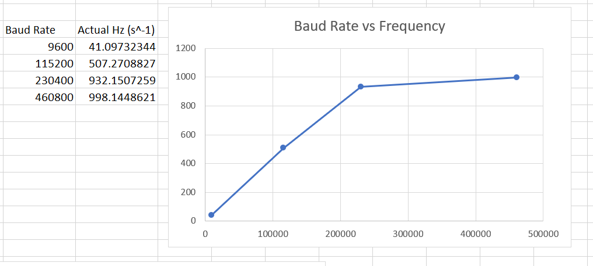

# ECE 16 Lab Report 3
Prepared By: Owen Bartolf
Date: 1/30/2020

## Tutorial 1: Python
>
> **Q. Show the code - Starting with a = “Hello World!!!”, come up with a code that will give us b = “Hello” and c = “World” and d = “!!!” . Also, in code, check if “ello” is in a.**
> 
> ```python
>
> # My first* Python Program!
>
>def main():
>    
>    # A
>    a = "Hello World!!!"
>    print(a)
>    
>    # Get B, C, D
>    b = a[0:5]
>    c = a[6:11]
>    d = a[11:14]
>    
>    print(b)
>    print(c)
>    print(d)
>    
>    if "ello" in a:
>        print("ello is in a!")
>
>
>if __name__ == "__main__":
>    main()
>
> # * I did a bit of Python in the past but nothing major. I'm excited to learn !!
> ```
>
> The following code accomplishes the above task.
>
> 
> **Q. In the following code, what is the output of the print statement? Why doesn’t original_list = ['hi','how','are','you']?**
>
> The scripting command newer_list[0:2] returns a new array with the elements of newer_list from 0 to 1. Basically, on the line where we set newer_list[0:2] equal to ["how", "are"], we're not actually saving anything because the lefthand operand is a new array and not a variable or other memory location.

## Tutorial 2: Numpy and Pyserial

>
> ### Connecting Arduino to Python
>
> _Quick Note: I'm using the encoding fix that was posted in Canvas instead of the code from the lab document. Answers may vary for this reason._
>
> **Q. Try sending without the .encode. What happens?**
>
> We get the following error:
> ```
> TypeError: unicode strings are not supported, please encode to bytes: 'Hello'
> ```
> There must be something about either the implementation of the PySerial library or the Serial protocol as a transport layer that prevents the use of unicode characters. Thus, we must convert to a format that it can accept, which happens to be UTF-8.
>
> The interesting thing about UTF-8 is that it is a variable-width encoding. This means that some characters exist that are represented with more than one byte. So, if we try to send characters from other languages, especially non-latin languages, we might encounter some problems where our Arduino serial reader parses a single character as two characters instead of one.  
>
> **Q. Identify in the above code, (1) which python command prints to the python’s own console, and (2) which python command prints to the serial port to the MCU?**
>
> Prints to own console...
>```py
> print(ser.name)
>```
> Transmits over serial to print on the OLED via serial transmission to MCU...
>```py
> ser.write(S.encode('utf-8')) 
>```
> **Q. What happens if you take out the \n in the string? Why?**
>
> Nothing will print on the screen. This is  because the newline character is our message delimiter in our very simple communications protocol. 
>
> Without the newline character, our protocol does not know when a given message terminates and a new one begins. Specifically, in our Arduino code, we continue writing to a receive buffer until we reach that character. Without the character, the Arduino will continue writing to the buffer forever without actually writing a message. There could even be an ArrayOutOfBounds error somewhere in there.
>
> ---
>
> ### Receiving Data with Python
> 
> **Q. Describe the output you observe on the Python side?**
>```
> Current Time: 11
> Current Time
>```
> It's literally just the 30 characters sent from the Arduino's serial port. Depending on what part of the program execution the Python program catches the timer in, we can get all sorts of messages, from the current time to state transition debug messages.
>
> **Q. Change the code to read 10 bytes instead of 30. Now what do you get? What are the 10 bytes you received? Remove decode might help you understand**
> 
> We get the same output, but with only 10 characters. If we remove decode, we can actually see that internally, Arduino serializes our string as a series of bytes before sending the data over the wire.
> ```
> b'Current Ti'
> ```
> The b prefix indicates that these characters are bytes. These bytes match the encoding; that's why we can read the "plain english" version on the other end when we decode the output.
>
> ---
>
> ### Receiving a Byte at a Time
>
> **Q. Describe the output you observe on the Python side? Is it the same as before? What does this tell you about the print() function of python?**
>
> The output is not the same because we feed the print function an array instead of a deserialized string. However, we learned that Python's print function is a lot more flexible than C's Serial.print() equivalent. This is probably due to the dynamic typing that happens behind the scenes with Python.
> 
> ### Knowing when to Quit
> 
> Q. We purposely made a few errors above. What were they?
>
> - Syntax error: The T in try should be lowercase.
>
> ---
>
> ### Numpy
> #### Numpy Array
> **Q. Show the code - Make an Numpy Array called test_array  from a list = [0,10,4,12]. Subtract 20 from the test_array, what do you get? What is the shape of the test_array**
>
> Below is the code to make an array from the given list.
>
> ```py
> def numpyArray0():
>     test_list = [0,10,4,12]
>     test_array = numpy.array(test_list)
>     print(test_array)
>     test_array = test_array - 20
>     print(test_array)
> ```
>
> If we subtract 20 from test_array using operators, we get a matrix with each element being 20 less than the original values.
>
> This matrix is a 4x1 matrix. If we specifically print the shape, it will return...
> ```
> test_array is a (4,) matrix.
> ```
>
> **Q. Show the code - Make a 2D array of test_2D_array from...** 
> ```
> [0,10,4,12]
> [1,20,3,41]
> ```
>
> Here is the code to do this!
> ```python
> def numpyArray1():
>     test_2d_array = numpy.array([[0,10,4,12], [1,20,3,41]])
>     print(test_2d_array)
>     print("test_2d_array is a " + str( test_2d_array.shape ) + " matrix.")
> ```
>
> ---
> #### Zeros and Ones
> **Q. Make a 2D array of zeros with shape of 10x20 and then print it out**
> 
> Here is the code to do that...
>
> ```python
> def numpyZeros():
>    test_zeros_list = numpy.zeros((10,20))
>    print(test_zeros_list)
> ```
>
> And the associated output...
> 
> ```python
> [[0. 0. 0. 0. 0. 0. 0. 0. 0. 0. 0. 0. 0. 0. 0. 0. 0. 0. 0. 0.]
> [0. 0. 0. 0. 0. 0. 0. 0. 0. 0. 0. 0. 0. 0. 0. 0. 0. 0. 0. 0.]
> [0. 0. 0. 0. 0. 0. 0. 0. 0. 0. 0. 0. 0. 0. 0. 0. 0. 0. 0. 0.]
> [0. 0. 0. 0. 0. 0. 0. 0. 0. 0. 0. 0. 0. 0. 0. 0. 0. 0. 0. 0.]
> [0. 0. 0. 0. 0. 0. 0. 0. 0. 0. 0. 0. 0. 0. 0. 0. 0. 0. 0. 0.]
> [0. 0. 0. 0. 0. 0. 0. 0. 0. 0. 0. 0. 0. 0. 0. 0. 0. 0. 0. 0.]
> [0. 0. 0. 0. 0. 0. 0. 0. 0. 0. 0. 0. 0. 0. 0. 0. 0. 0. 0. 0.]
> [0. 0. 0. 0. 0. 0. 0. 0. 0. 0. 0. 0. 0. 0. 0. 0. 0. 0. 0. 0.]
> [0. 0. 0. 0. 0. 0. 0. 0. 0. 0. 0. 0. 0. 0. 0. 0. 0. 0. 0. 0.]
> [0. 0. 0. 0. 0. 0. 0. 0. 0. 0. 0. 0. 0. 0. 0. 0. 0. 0. 0. 0.]]
> ```
>
> ---
>
> #### hstack and vstack
> **Q. Show the code - Out of the test_array, create the following using hstack and vstack. **
>
> ```
> The format of the "following" matrix on the lab report was impossible to transpose quickly so refer to it on the lab.
> ```
>
> Here is the code to accomplish the task...
>
> ```python
> def vhstackDemo():
>     print("---------------------------")
>     print("vhstack Demo")
>     
>     basicUnit = numpy.array([0, 10, 4, 12])
>     horizontal = numpy.hstack((basicUnit, basicUnit))
>     vertical = horizontal
>     for i in range(3):
>        vertical = numpy.vstack((vertical, horizontal))
>     print(vertical)
> ```
>
> ---
> #### arange
> **Q. Show the code - Using arange, make an array called arange_array1 to equal [-3, 3,9,15] and arange_array2 to equal [ -7,  -9, -11, -13, -15, -17, -19]**
>
> Here is the code to do that!
>
> ```python
> def arangeDemo():
>     print("---------------------------")
>     print("arange Demo")
>     arange_array1 = numpy.arange(-3, 16, 6) # Second parameter is exclusive
>     arange_array2 = numpy.arange(-7, -20, -2)
>     print(arange_array1)
>     print(arange_array2)
> ```
> And here is the output...
>
> ```
> arange Demo
> [-3  3  9 15]
> [ -7  -9 -11 -13 -15 -17 -19]
> ```
>
> ---
>
> #### linspace
> **Q. Make an array call linspace_array using linspace that goes from 0 to 100 with 49 steps.**
>
> Here is the following code to do that.
>
> ```python
> def linspaceDemo():
>     print("---------------------------")
>     print("linspace Demo")
>     linspace_array = numpy.linspace(0, 100, num=49)
>     print(linspace_array)
> ```
>
> And the output...
>
> ```
> linspace Demo
> [  0.           2.08333333   4.16666667   6.25         8.33333333
> 10.41666667  12.5         14.58333333  16.66666667  18.75
>  20.83333333  22.91666667  25.          27.08333333  29.16666667
>  31.25        33.33333333  35.41666667  37.5         39.58333333
>  41.66666667  43.75        45.83333333  47.91666667  50.
>  52.08333333  54.16666667  56.25        58.33333333  60.41666667
>  62.5         64.58333333  66.66666667  68.75        70.83333333
>  72.91666667  75.          77.08333333  79.16666667  81.25
>  83.33333333  85.41666667  87.5         89.58333333  91.66666667
>  93.75        95.83333333  97.91666667 100.        ]
> ```
> **Q. How does linspace and arange differ? When might you use one over the other?**
>
> The arange function returns an array with the elemented between start and stop by counting up by the given step. It's kind of like a for loop.
>
> The linspace function returns an array that includes evenly-spaced samples between a high-end and a low end by dividing the given range into samples.
>
> You might use linspace if you want to construct an array composed of values between two numbers while knowing exactly how many samples between those values are desired. You might use arange instead of the number of samples between the two numbers is unknown. You might also use arange if you want even steps between the two endpoints rather than a number of predetermined subdivisions.
>
> ---
>
> #### Indexing and Slicing
> **Q. What is an array of size 3x4 that would produce the following results. Show your work on how you deduced your answer on paper or some kind of graphics :**
>
> ```
> print(e[0])     >>> [12 3 1 2]
> print(e[1,0])  >>> 0
> print(e[:,1])   >>> [3 0 2]
> print(e[2, :2])>>> [4 2]
> print(e[2, 2:])>>> [3 1] 
> print(e[:,2])  >>> [1 1 3]
> print(e[1,3]) >>> 2
> ```
>
> I took a visual approach. You can see the breakdown in the graphic; every array element I found corresponds to a certain question via color coding...
>
> 
>
> You can see that my array does indeed fulfill all challenges when input into the following unit test code!
>
> ```python
> import numpy
> 
> e = numpy.array([
>             [12, 3, 1, 2],
>             [0, 0, 1, 2],
>             [4, 2, 3, 1]
>         ])
> 
> print("Unit testing e for challenge fulfillment!")
> print("e[0] == [12, 3, 1, 2]?   " + str(numpy.array_equal(e[0], [12, 3, 1, 2])))     # >>> [12 3 1 2] – Direct Index
> print("e[1,0] == 0?             " + str(e[1,0] == 0) )   # >>> 0 – Direct Index
> print("e[:,1]) == [3, 0, 2]?    " + str(numpy.array_equal(e[:,1], [3, 0, 2])))    # >>> [3 0 2]
> print("e[2, :2] == [4, 2]?      " + str(numpy.array_equal(e[2, :2], [4, 2]))) # >>> [4 2]
> print("e[2, 2:] == [3, 1]?      " + str(numpy.array_equal(e[2, 2:], [3, 1]))) # >>> [3 1] 
> print("e[:,2] == [1, 1, 3]?     " + str(numpy.array_equal(e[:,2], [1, 1, 3])))   # >>> [1 1 3]
> print("e[1,3] == 2?             " + str(e[1,3] == 2))   # >>> 2 – Direct Index
> print("If any were false, then it was not successful. Otherwise, we're good!")
> ```
> The following unit test outputs the following...
>
> ```
> Unit testing e for challenge fulfillment!
> e[0] == [12, 3, 1, 2]?   True
> e[1,0] == 0?             True
> e[:,1]) == [3, 0, 2]?    True
> e[2, :2] == [4, 2]?      True
> e[2, 2:] == [3, 1]?      True
> e[:,2] == [1, 1, 3]?     True
> e[1,3] == 2?             True
> If any were false, then it was not successful. Otherwise, we're good!
> ```
>
> Stuff works!
>
> ---
>
> #### Setting values of arrays
>
> **Q. Show your code - Now solve the above indexing and slicing problem by writing the code using array assignment.**
>
> I wrote this code and it did the trick.
> ```python
> import numpy;
> 
> e = numpy.zeros((3,4))
> 
> e[0] = [12, 3, 1, 2]
> e[1,0] = 0
> e[:,1] = [3, 0, 2]
> e[2, :2] = [4, 2]
> e[2, 2:] = [3, 1] 
> e[:,2] = [1, 1, 3]
> e[1,3] = 2
> 
> print(e)
> ```
>
> ---
> #### Setting values of array from CSV
> **Q. Using fromstring, vstack, and a for loop, create an array of 100x4 from s: [[1,2,3,4],[1,2,3,4],[1,2,3,4].....[1,2,3,4]].**
>
> Here's my code to complete the task.
> ```python
> import numpy
> 
> data_string = '1,2,3,4'
> data_as_array = numpy.fromstring(data_string, dtype=int, sep=',')
> stack_array = data_as_array[:]
> 
> for i in range(100):
>     data_as_array = numpy.vstack((data_as_array, stack_array))
> 
> print(data_as_array)
> ```
>

## Pre-Challenge Refactors
>
> I improved upon the Message library we built in the last lab. Instead of only displaying one message, I built a system that displays the new message and the previous two on the lines above. In exchange for this feature, we sacrifice the ability to print messages to a specific line.
>
> In addition, I refactored the Receive code to throw every received buffer into a struct with an ID and an integer that describes the actual size of the buffer. From there, I was able to convert the buffers into strings fairly easily.
>

## Challenge 1
>
> **Demo of working serial communication!**
>
> 
>
## Challenge 2
>
> **Q. What happens if you don’t decode the incoming char?**
>
> Nothing. Because we use...
> ```python
> if( byte_recv == '\n'):
> ```
> ...to check for the end of a packet, we never reach the end of a packet. This is because the byte value of the received byte does not equal its string representation.
>
> **Q. Try removing the logic for checking if the data_array is empty and always vstack even if the data_array is empty. What is the error that gets thrown? Why?**
>
> The following error is thrown:
> ```
> ValueError: all the input array dimensions except for the concatenation axis must match exactly
> ```
> This error is thrown because numpy does not know how to handle the vertical addition of different-sized arrays. Matrices must be of a consistent size (2x2, 3x3, 1x4). An error is thrown instead of the alternative because doing something like this is usually indicative of code that isn't working as intended.
>
> **Q. Try removing the 1 second delay on the MCU when starting data sending. Describe what happens?**
> 
> We can get an issue where we catch a "sentence" in mid-transmit, causing half of the transmitted values to be cut off. In the best-case version of this error, none of the commas are lost and we only have a malformed sample. In the worst case version, we miss a comma. In this case, the missed comma will cause the next array to be appended with an incorrect linear dimension, yielding an error.
>
## Challenge 3
> 
> **Q. Start with Baud rate of 115200. What is your calculated sampling rate when you set the sampling rate to 10Hz,50Hz,100Hz,1000Hz on the MCU. Make a plot (using a spreadsheet program) of the actual sampling rate (y-axis) vs expected sampling rate (x-axis).**
>
> 
> 
> I retrieved the following values...
> 
> | Sampling Rate | Actual Sampling Rate |
> |---------------|----------------------|
> | 10            | 9.999680818          |
> | 50            | 49.99151659          |
> | 100           | 99.96516366          |
> | 1000          | 507.2708827          |
> 
> It works incredibly well until we get to high frequencies, where we got completely unexpected behavior. This could be for two reasons. First, the baud rate might be too slow for our desired transmission speed. Second, it could be that microseconds aren't good enough for that high of a refresh rate, or another part of our program has overhead that exceeds the time required to reasonably take 1000 samples every second.

> **Q. How does this change with Baud rate 9600 vs 115200 vs 230400 vs 460800. For 1000Hz, make a plot of the actual sampling rate (y-axis) vs Baud Rate (x-axis).**
>
> 
> 
> I retrieved the following values...
> 
> | Sampling Rate | Actual Sampling Rate |
> |---------------|----------------------|
> | 9600          | 41.09732344          |
> | 115200        | 507.2708827          |
> | 230400        | 932.1507259          |
> | 460800        | 998.1448621          |
>
> It appears that the actual sampling rate increases fairly linearly until a critical point near a transmission rate of 230400 bits/second. This is because after that point, we have enough bandwidth to send at our desired frequency without our data being bottlenecked and throttled. 
>
> **Q. What happens if you use millis instead of micros for timing and Why?**
> 
> 