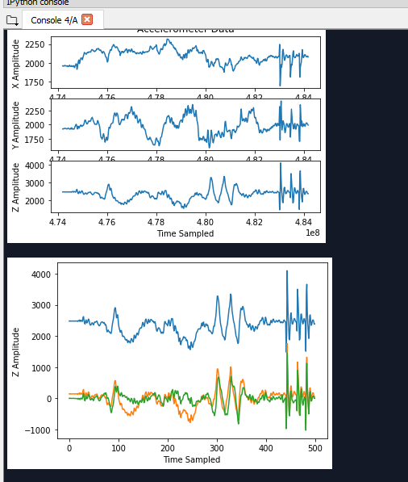

# ECE 16 Lab Report 4
Prepared By: Owen Bartolf | Date: 2/13/2020

## Tutorial
> ### MAX30105 Pulse Sensor
>
> ---
>
> Here is a demo of the Heartbeat Plotter tutorial in action.
> 
>
> **Q. Note that you can connect both the heart rate sensor and your OLED at the same time, both of which use the I2C SDA and SCL lines. Why does this work?**
>
> We can due this because of how I2C as a protocol is designed. Every I2C device is assigned an address. Whenever a message is to be transmitted to a device on an I2C wire, the protocol first sends the address towards which the transmission is directed. In protocol design, this is called sending a "header." The message is then only processed by the device whose address matches the header information. This allows multiple devices to be "chained" together on a single I2C wire.
>
> **Q. Notice the while(1) statement. What happens if the device is not connected? What happens if the error is printed and then you connect the device? Will the code proceed? Try it and describe the behavior.**
>
> If the device is not connected, an error message is printed and the program hangs. While the ```while(1)``` statement does not have a body defined, the statement still executes. Because the loop's conditional has no scenario where it will evaluate to false, the program will hang indefinitely at the statement if the device is not detected. Even if the device is reconnected, the program will still hang indefinitely for the same reason.
>
> This makes sense; we do not want to execute a program if the hardware that is critical for its execution is unavailable or otherwise does not exist! We also don't want to write super-complicated code to detect a loss of connection and attempt to re-establish it on a device where a loss of connection probably means there is unavoidable damage to the actual hardware.
> 
> **Q. what would the settings look like if you were to: set the led brightness to 25mA, use only the Red + IR LED, Sample at 200Hz, and use an ADC range of 8192?**
>
> The following settings should do the trick...
>
> ```c
> byte ledBrightness = 127; //Options: 0=Off  to 255=50mA
> byte sampleAverage = 8; //Options: 1, 2, 4,  8, 16, 32
> byte ledMode = 2; //Options: 1 = Red only,  2 = Red + IR, 3 = Red + IR + Green
> int sampleRate = 200; //Options: 50, 100,  200, 400, 800, 1000, 1600, 3200
> int pulseWidth = 411; //Options: 69, 118,  215, 411
> int adcRange = 8192; //Options: 2048, 4096,  8192, 16384
> ```
> **Q. What are the units of the pulse width? Would the bigger the pulseWidth result in a more intense or less intense measurement? Why?**
>
> According to the datasheet, the units for pulse width are microseconds (µs). 
> 
> 
>
> Essentially, the pulse width dictates the amount of time per second that the LED is in the ON state rather than in the OFF state. A higher pulse width value will toggle the LED for a longer period of time every second, increasing the number of potential photons that could hit the sensor and thus causing a more intense reading. Likewise, a smaller pulse width would emit fewer relative photons, reducing the intensity of the reading.
>
> **Q. How many bits are needed for an ADC range of 16384?**
>
> 2 to the power of 14 is 16384. Therefore, for an ADC range of 16384, we need to use a primitive with at least 14 bits wide. If we use less, we will encounter overflow issues.
>
> **Q. What is the peak wavelength of the R, IR, and G LEDs?**
>
> Below are the peak wavelengths for each LED as taken from the particle sensor datasheet. 
>
> | LED      | Min Peak λ | Typical Peak λ | Max Peak λ |
> |----------|------------|----------------|------------|
> | Red      | 650        | 660            | 670        |
> | Green    | 530        | 537            | 545        |
> | Infrared | 870        | 880            | 900        |
>
> **Q. If you want to read the Green value, what Mode do you need the setting to be in and what function will you need to use to get the green signal?**
>
> The mode must be 3; in no other mode is the green LED activated. Then, ```particleSensor.getGreen()``` should be called.
>
> ### Tutorial 2: Matplotlib
> 
> **Q. What was plotted? What does this tell you about how plt.plot interprets the input?**
>
> The following image was plotted...
>
> 
>
> As we can see, the plt.plot() function plots a line for each column in a numpy matrix. In other words, plt.plot() interprets the input matrix as a list of sets, where each column is a plottable set.
>
> ### Tutorial 3: Saving and Reading via IO
>
> The file that was to be generated in the tutorial can be found 
>
> **Q. Try your best to replicate the above plot by shaking your accelerometer. The above was sampled at 50Hz for 10 seconds. Make a gif of you running your program, shaking your accelerometer, and a plot showing up similar to the one above.**
>
> 
>
> **Q. What is approximately the frequency of oscillation of the x axis signal in the plot above?**
>
> 
>
> The chart represents ten seconds of samples. If we tesselate the sequence of shakes across the entire sample space, we discover that we can tesselate up to five sequences over the entire interval. In other words, this means that over ten seconds, we could fit five sequences of shakes, so each sequence of shakes is 2 seconds long.
>
> From there, it's a simple frequency calculation.
>
> Frequency = Cycles / Seconds
>
> Frequency = 4 cycles / 2 seconds
>
> **Frequency = 2 Hz**
>
> ### Tutorial 4: Removing Mean Offset
>
> I did this task successfully! Orange is zeroed; I tapped the hardware about one time per second.
>
> 
>
> ### Tutorial 5: Smoothing with Moving Average
> 
> **Q. Try different n_avg and document, with plots, the result for a few different n_avg and describe which n_avg worked well in emphasizing the taps?**
>
> I tried a few values, here are the highlights, where green is the plotted moving average...
>
> 5 Samples.
>
> 
>
> I think 10 samples worked the best for the moving average. It hits a pretty good balance between having a running history, but not having that history be too long as to make it meaningless.
>
> 
>
> 10 samples again, but with a high amount of motion. Still works pretty well...
>
> 
>
> A Bigger value doesn't always mean a better reduction; in fact, large values like 50 tended to provide ill results. This is because when the moving average goes back so far, slow changes have a much greater weight on the overall mean of the current value. For example, check out the plot for Detrend 20:
>
> 
>
> ### Tutorial 6: Looking at the Signal in Different Ways
>
> **Q. Try using np.diff(s) to calculate the gradient of the signal s and plot the signal.**
>
> Here is the plot that shows the difference over time. It's the red line. As you can see, it's way more effective than the other methods for detecting taps vs. regular variation.
>
> 
> 
> 
## Challenge 1
> 
> 
> **Q. Why do we plot the negative of the signal? This has to do with light absorption. We talked about it in class.**
>
> It has to do with how the sensor itself functions, combined with how we are using it to detect a heartbeat. This particle sensor is really just a light intensity sensor with some extra hardware for signal processing. The numerical output does not represent meaningful information in and of itself, but rather it represents the amount of light detected from the LED emitter.
>
> Because this is just a glorified light intensity sensor, we can detect all sorts of things that depend on light intensity at certain wavelengths. For example, this sensor is also capable of detecting smoke in a gaseous environment because the smoke reduces the intensity of the reflected emitted light compared to a clean environment.
>
> For our application, we are trying to detect a heartbeat through skin. As blood pumps through a body, it isn't cycled continuously. There are moments in the heartbeat where there is a higher amount of blood in the finger compared to the baseline. When there is more blood, more light is blocked. By inverting the signal, we make the points at which the light intensity is the lowest into the point at which the plotted value is the highest. This is ultimately more meaningful than the raw data.
>
>
> **Q. Try different sampleAverage parameters and plot them. What is the effect of sampleAverage on the smoothness of the signal?**
>
> A higher sample average smooths the signal output, but it smooths both the ambient reading and the peaks. If we increase our sample average by too much, the meaning is "flattened" out of our data. Likewise, if we decrease our sample average by too much, the peaks are clearly distinguishable but there exists an awful amount of noise.
>
> Sample Average 2
> 
> 
>
> Sample Average 4
>
> 
>
> Sample Average 8
>
> 
>
> Sample Average 16
>
> 
> 
> **Q. Try different ledBrightness. Is brighter always better? Why or why not?**
>
> Brighter is not always better; beyond a certain point, the brightness of the LED emitter becomes so intense that it overwhelms the light intensity sensor, reading a constant value of 2^18 - 1, or 262143. Because its so bright, we exceed the upper bound of the sensor and thus data is lost.
>
> **Deliverable: Tune the settings so that you ultimately get a sampling rate of 50Hz. What setting did you land on that gave you a clean signal and at the right sampling rate? Show a gif of you starting your code, and end with the plot appearing. Also include a still image of the plot.**
>
> Here are my settings, verbatim:
>
> ```c
> byte ledBrightness = 37; //Options: 0=Off to 255=50mA
> byte sampleAverage = 4; //Options: 1, 2, 4, 8, 16, 32
> byte ledMode = 1; //Options: 1 = Red only, 2 = Red + IR, 3 = Red + IR + Green
> int sampleRate = 3200; // Without this, the sample rate is too slow for our refresh rate.
> int pulseWidth = 411; //Options: 69, 118, 215, 411
> int adcRange = 4096; //Options: 2048, 4096, 8192, 16384 (12 BITS)
> ```
>
> Here's a gif of the device in action:
>
> 
>
> Here's the readout from the video:
>
> 
>

## Challenge 2

> **Q. Note that it is very important to normalize AFTER you’ve done the filtering. Try normalizing before filtering and describe what happens and why it doesn’t work for helping with our threshold.**
>
> If we do not normalize before filtering, our unfiltered range will be normalized from zero to one. This means all of our filtering will be evaluated on a variable curve from zero to one. In addition to all of the precision issues this has, the various transformations and filtering operations compress the dataset down to a miniscule range that doesn't have any meaning. 
>
> The reason we normalize afterwards is to make all data universally fit between zero and one, no matter if the data has a moving average or different baseline. This allows us to use the same threshold for every set of observations. When normalizing before signal filtering, we don't get this property, and thus our universal baseline is meaningless except in a very narrow range of cases that tend to not exist in reality. 
>
> **Q. What threshold did you find to work well and how did you determine it?**
>
> .5 seemed to work great as a threshold. I came to this number mostly by running the sensor and tweaking my operation parameters to make the local extrema as close to one and zero as possible. With these tweaks, .5 is pretty safe because the height of the peaks ensures that only the meaningful changes are detected.
>
> **Q. Show a scatter plot of your heart rate calculation (y axis) vs the heart rate of the reference. Calculate the Root Mean Squared Error (RMSE) of your detected heart rate vs the reference heart rate. RMSE is calculated as the square root of the mean of the square of the difference between your estimated heart rate and the reference heart rate. More about RMSE can be found here: https://towardsdatascience.com/what-does-rmse-really-mean-806b65f2e48e.**


## Challenge 3

> **Q. We made a few mistakes in the above code, identify them and fix them. :)**
>
> 
>
> **Q. Now add a new module in Libraries called HR.py for the heart rate and signal processing methods we made in this lab. And then in the Wearable.py, add the code to calculate heart rate and print out the heart rate. Show in a gif capturing the pulse for 10 seconds, plot and print out the calculated heart rate.** 
>