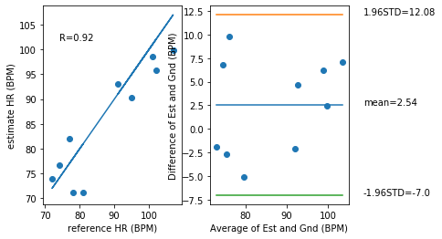
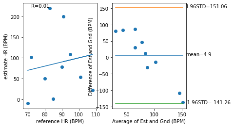
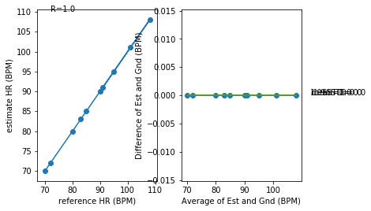
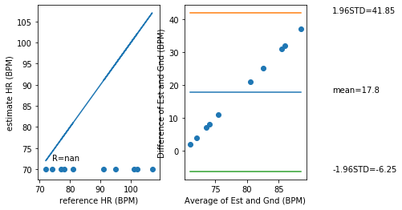
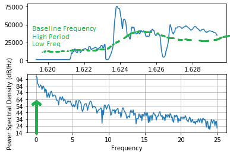
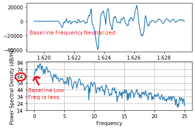
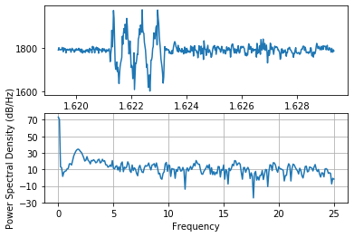

# ECE Lab 5
Prepared By: Owen Bartolf | 2/25/2020

[Return to Table of Contents](TableOfContents.md)

## Tutorial
> ### Correlation and Bland-Altman Plot
>
> Q. **Which metric (R,RMSE,STD,Bias) do you use to look at each of the four key analysis?**
>
> - We use **RMSE** as a first-step to understanding the **accuracy** of the data. However, we don't use it in deeper analyses because RMSE returns similar values for biased data that trends over or under the reference consistently. 
> - We use **STD** to measure **PRECISION.** Data with a greater spread will return a higher standard deviation consistently, so this is a good metric to quantify how precise a measurement is compared to its statistical center.
> - We use **Bias (the numerical calculation)** to measure **bias (the concept that our measurements might consistently trend above or below the expected value).**
> - We use **R** to measure **correlation.** The R value returns a value between -1 and 1, where 1 means the data perfectly correlates to the expected values, zero means there is no correlation to speak of, and -1 means there is a perfect negative correlation.
>
> Q. **Using the above code, plot the correlation and bland-altman plot of your lab 4 HR estimation vs the reference. What is your R value, bias, and 95% limits of agreement?**
>
> 
>
> The requested statistics are below.
>
> | Statistic       | Value |
> |-----------------|-------|
> | R Value         | 0.918 |
> | Bias            | 2.54  |
> | 95% Upper Limit | 12.08 |
> | 95% Lower Limit | -7.0  |
>
>
> Q. **Sketch the correlation plot that would give you an R of 0. What does an R of 0 mean?**
>
> 
>
> This graph has an R value of roughly zero.
>
> The R value is the correlation coefficient, and it measures how much the data fits the estimation from -1 to 1. An R value of zero means that the data is perfectly correlated to the estimate, whereas an R value of one means that there is no correlation whatsoever and -1 means there is a perfect negative correlation. Thus, a plot with an R value of zero means that the data has no correlation whatsoever with the estimation set.
>
> Q. **Sketch a scatter plot of the correlation and bland-altman plot if your estimation was perfect every time. What would be the R, RMSE, Bias, and STD value of a perfect estimator?**
>
> 
>
> - For the precise reason stated in the above question, our **R value** would be 1 because the data is perfectly positively correlated. While a large decimal like .99999999 was returned when I executed the program, this is due to floating point errors.
> - Our **RMSE value** should be zero because the main component of the RMSE calculation is the differences between the y components of the datapoints...
> 
> ...because the reference and estimate are identical, the difference will be zero, making the whole calculation zero.
> - Our bias should be 0; the data perfectly matches the model, so there shouldn't be any bias to speak of.
> - Our STD value should be 0; all the data is the same, so there's not really any basis to make a "standard deviation" because the data literally doesn't deviate whatsoever.
>
> Q. **How might we use the 1.96STD mark to assess if a given estimate might be an outlier?**
>
> Standard deviation is used to measure the spread of the data based on a normal distribution. Given a normal distribution, the interval [-1.96, 1.96] represents the range where roughly 95% of all observations should lie. Thus, if there is a datapoint that does not lie in that interval, it represents 5% of the most extreme observations. This is a pretty good metric for quantifying what an outlier is.
>
> Q. **What would your Bland-Altman plot look like if your algorithm always guessed 70BPM regardless of the actual heart rate? Describe some prominent features about the graph beyond just showing it.**
>
> Pictures say a thousand words:
>
> 
>
> The prominent feature is that every value is aligned horizontally on the scatter plot. This makes sense; our reference is constant, while our estimate is variable.
>
> The Bland-Altman plot is also linear in nature. This makes sense as the difference between the estimation and reference will always center around the number 70.
>
> Additionally, our R value is "NaN," or Not a Number. This means there was very likely a divide-by-zero error caused by having all of the data aligned in a single axis.
>
> ### Frequency Domain
> **Q. If your sampling rate was 120Hz, what would be your maximum frequency (the Nyquist frequency)?**
>
> Applying the Sampling Theorem...
> > _A signal can be reproduced without distortion if it is sampled at a rate of **fs** which is greater than twice the maximum frequency **B** that is found in the signal. Or, in other terms...
> >
> > fs / 2 > B or fs > 2B
>
> Our sampling rate is 120Hz, so plug into the formula...
>
> 120 > 2B
> 60 > B
>
> Our maximum frequency should be the infimum of the set (60, 0). In other words, our maximum frequency is the smallest number less than 60 by the SamplingTtheorem.
> 
> It's worth nothing that the Sampling Theorem is theoretical and might not be good for actual practice. Prof. Wang recommends the sampling rate minimum to be at least four times the maximum observed frequency to adjust for real-world conditions.
>
> **Q. If your signal bandwidth is composed of 0-10Hz, what is your minimum sampling rate to capture this signal based on the Nyquist sampling theorem? What would be recommended in general practice however?**
>
> Applying the Sampling Theorem...
>
> Our maximum observed frequency is 10 Hz; B = 10 
>
> fs > 2B
>
> fs > 20 Hz
>
> According to the Sampling Theorem, our sampling rate should be _at least 20Hz_.
>
> Just like I said in the above answer, electrical engineers generally recommend four times the maximum observed sampling rate to make up for real world unpredictability and conditions.
>
> ### Baseline DC Signal
> **Q. How does your detrend function modify the frequency content of the signal? Show the plot and circle the part that is most modified and explain why.**
>
> Before Detrend...
>
> 
>
> After Detrend...
>
> 
>
> The main change was that the baseline DC signal was filtered from the PDS plot. Because we're using sensors that might not have a constant observation or stable current between it and the microcontroller, we can observe that there is a very slow-moving drift in the unfiltered observations. By detrending the data, we do our best remove this slow drift, removing the quantity of low-frequency waves present in the data. The result is reflected in the PSD plot. 
>
> ### Dominant Frequency Component
>
> **Q. Show the code - Use np.argmax to find the actual dominant frequency of the x acceleration (currently labeled as 1Hz in the above plot). The aim here is to use argmax to get the index of the maximum value of Pxx and then use that index to get the corresponding frequency in the Freqs array. Try this with and without removing the DC offset. What do you get?**
> 
> Using the following code, we can extract the dominant frequency from the Freqs array by first finding the index of the largest frequency in Pxx... 
>
> ```python
> fs = 50 #sampling rate in Hz
> t = data_array[:, 0]  #get the time array
> s = data_array[:, 1] # get the x-acceleration array, or replace constant with column of desired data
> s = detrend(s, 16)
> 
> Pxx, Freqs = plt.psd(s, NFFT=len(t), Fs=fs)
> index_of_largest_freq = np.argmax(Pxx) # Get index of largest value
> largest_freq = Freqs[index_of_largest_freq] # Extract frequency from Freqs using index
>
> # Print to be nice. 
> print(index_of_largest_freq)
> print(largest_freq)
> ```
> We get 0 as the dominant frequency of the X axis accelerometer measurement without detrending. This makes sense if we look at the graph of the power of the various frequencies observed...
>
> 
>
> According to the chart, we can see that the DC drift for this set of observations will overpower all other frequencies. Thus, the application thinks the dominant frequency is zero.
>
> We get 1.8 Hz as the dominant frequency of the X axis accelerometer measurement if we detrend to remove the baseline DC frequency. This makes a lot more sense as we can clearly see that the accelerometer shaking in the chart is around 2 Hz (I think we even calculated this in [Lab 4 Tutorial 3](Lab4.md)! ) 
>
> **Q. If we don’t remove the DC offset first, how can we index Pxx such that when we calculate argmax, we don’t look at the Pxx[0] (skipping the 0 index).**
>
> We can use simple numpy matrix indexing to slice the first index out of the array...
>
> ```python
> index_of_largest_freq = np.argmax(Pxx[1:]) # Slices off the first value of Pxx.
> ```
>
> However, it is better to detrend because this doesn't really work reliably. Sometimes, the baseline frequency spikes the relative power of indices 0-10+, but it isn't consistent. This is similar to the threshold problem we encountered in [Lab 2](Lab2.md), and we solved it explicitly by using signal processing. We should just continue to process our signals to get what we want instead of relying on arbitrary thresholds.
>
> **Q. What is the dominant frequency for the y and z acceleration in the sample?**
> 
> Using our code above, we get the following values...
>
> | Axis | Dominant Frequency |
> |------|--------------------|
> | Y Axis | 1.9 Hz |
> | Z Axis | 2.0 Hz |
>

## Pre-Challenge Disclaimer:
> **Because all of my finals are either this weekend or early next week, I thought it neccessary to save some time. To save time, I'm just going to write all of my challenges as objects so I don't have to transform all of my libraries to objects at the end.**
>
> **Thanks for understanding!**

## Challenge 1
> 

[Return to Table of Contents](TableOfContents.md)