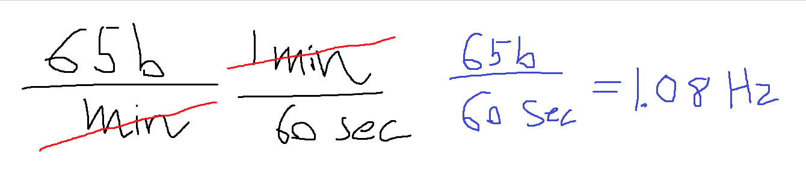
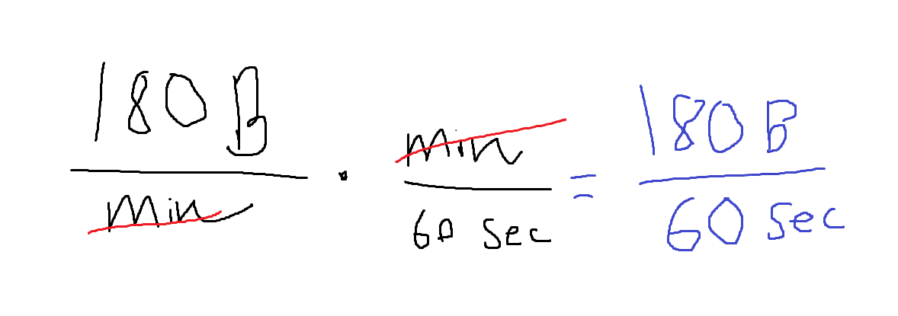
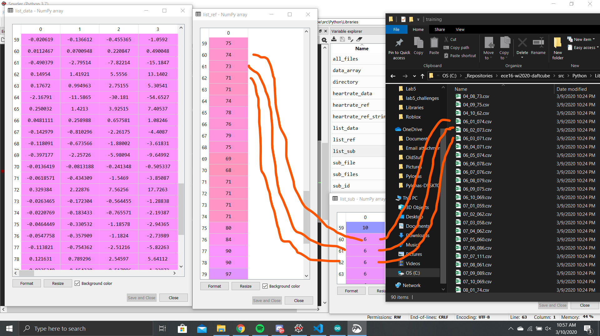
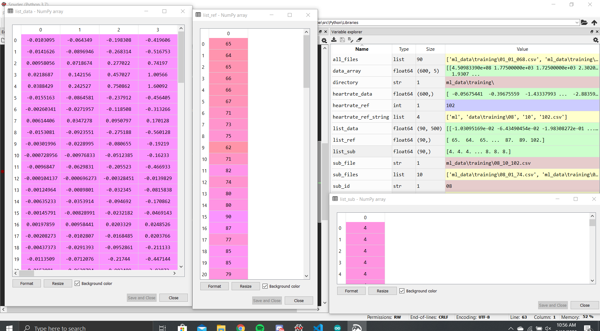
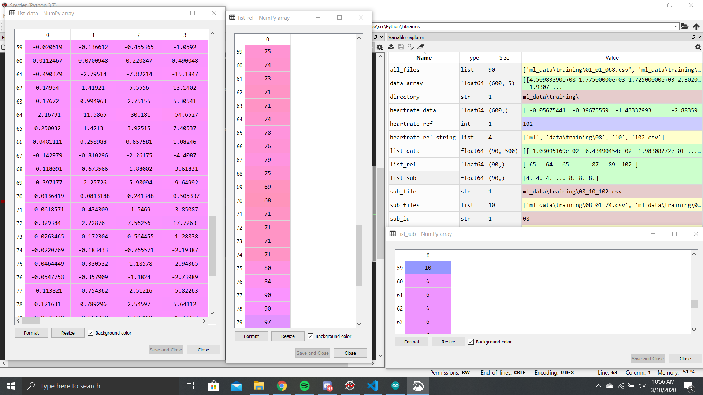
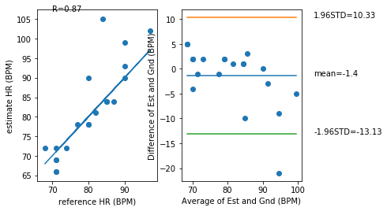

# ECE Lab 5
Prepared By: Owen Bartolf | 2/25/2020

[Return to Table of Contents](TableOfContents.md)

## Tutorial
> ### Correlation and Bland-Altman Plot
>
> Q. **Which metric (R,RMSE,STD,Bias) do you use to look at each of the four key analysis?**
>
> - We use **RMSE** as a first-step to understanding the **accuracy** of the data. However, we don't use it in deeper analyses because RMSE returns similar values for biased data that trends over or under the reference consistently. 
> - We use **STD** to measure **PRECISION.** Data with a greater spread will return a higher standard deviation consistently, so this is a good metric to quantify how precise a measurement is compared to its statistical center.
> - We use **Bias (the numerical calculation)** to measure **bias (the concept that our measurements might consistently trend above or below the expected value).**
> - We use **R** to measure **correlation.** The R value returns a value between -1 and 1, where 1 means the data perfectly correlates to the expected values, zero means there is no correlation to speak of, and -1 means there is a perfect negative correlation.
>
> Q. **Using the above code, plot the correlation and bland-altman plot of your lab 4 HR estimation vs the reference. What is your R value, bias, and 95% limits of agreement?**
>
> 
>
> The requested statistics are below.
>
> | Statistic       | Value |
> |-----------------|-------|
> | R Value         | 0.918 |
> | Bias            | 2.54  |
> | 95% Upper Limit | 12.08 |
> | 95% Lower Limit | -7.0  |
>
>
> Q. **Sketch the correlation plot that would give you an R of 0. What does an R of 0 mean?**
>
> 
>
> This graph has an R value of roughly zero.
>
> The R value is the correlation coefficient, and it measures how much the data fits the estimation from -1 to 1. An R value of zero means that the data is perfectly correlated to the estimate, whereas an R value of one means that there is no correlation whatsoever and -1 means there is a perfect negative correlation. Thus, a plot with an R value of zero means that the data has no correlation whatsoever with the estimation set.
>
> Q. **Sketch a scatter plot of the correlation and bland-altman plot if your estimation was perfect every time. What would be the R, RMSE, Bias, and STD value of a perfect estimator?**
>
> 
>
> - For the precise reason stated in the above question, our **R value** would be 1 because the data is perfectly positively correlated. While a large decimal like .99999999 was returned when I executed the program, this is due to floating point errors.
> - Our **RMSE value** should be zero because the main component of the RMSE calculation is the differences between the y components of the datapoints...
> 
> ...because the reference and estimate are identical, the difference will be zero, making the whole calculation zero.
> - Our bias should be 0; the data perfectly matches the model, so there shouldn't be any bias to speak of.
> - Our STD value should be 0; all the data is the same, so there's not really any basis to make a "standard deviation" because the data literally doesn't deviate whatsoever.
>
> Q. **How might we use the 1.96STD mark to assess if a given estimate might be an outlier?**
>
> Standard deviation is used to measure the spread of the data based on a normal distribution. Given a normal distribution, the interval [-1.96, 1.96] represents the range where roughly 95% of all observations should lie. Thus, if there is a datapoint that does not lie in that interval, it represents 5% of the most extreme observations. This is a pretty good metric for quantifying what an outlier is.
>
> Q. **What would your Bland-Altman plot look like if your algorithm always guessed 70BPM regardless of the actual heart rate? Describe some prominent features about the graph beyond just showing it.**
>
> Pictures say a thousand words:
>
> 
>
> The prominent feature is that every value is aligned horizontally on the scatter plot. This makes sense; our reference is constant, while our estimate is variable.
>
> The Bland-Altman plot is also linear in nature. This makes sense as the difference between the estimation and reference will always center around the number 70.
>
> Additionally, our R value is "NaN," or Not a Number. This means there was very likely a divide-by-zero error caused by having all of the data aligned in a single axis.
>
> ### Frequency Domain
> **Q. If your sampling rate was 120Hz, what would be your maximum frequency (the Nyquist frequency)?**
>
> Applying the Sampling Theorem...
> > _A signal can be reproduced without distortion if it is sampled at a rate of **fs** which is greater than twice the maximum frequency **B** that is found in the signal. Or, in other terms...
> >
> > fs / 2 > B or fs > 2B
>
> Our sampling rate is 120Hz, so plug into the formula...
>
> 120 > 2B
> 60 > B
>
> Our maximum frequency should be the infimum of the set (60, 0). In other words, our maximum frequency is the smallest number less than 60 by the SamplingTtheorem.
> 
> It's worth nothing that the Sampling Theorem is theoretical and might not be good for actual practice. Prof. Wang recommends the sampling rate minimum to be at least four times the maximum observed frequency to adjust for real-world conditions.
>
> **Q. If your signal bandwidth is composed of 0-10Hz, what is your minimum sampling rate to capture this signal based on the Nyquist sampling theorem? What would be recommended in general practice however?**
>
> Applying the Sampling Theorem...
>
> Our maximum observed frequency is 10 Hz; B = 10 
>
> fs > 2B
>
> fs > 20 Hz
>
> According to the Sampling Theorem, our sampling rate should be _at least 20Hz_.
>
> Just like I said in the above answer, electrical engineers generally recommend four times the maximum observed sampling rate to make up for real world unpredictability and conditions.
>
> ### Baseline DC Signal
> **Q. How does your detrend function modify the frequency content of the signal? Show the plot and circle the part that is most modified and explain why.**
>
> Before Detrend...
>
> 
>
> After Detrend...
>
> 
>
> The main change was that the baseline DC signal was filtered from the PDS plot. Because we're using sensors that might not have a constant observation or stable current between it and the microcontroller, we can observe that there is a very slow-moving drift in the unfiltered observations. By detrending the data, we do our best remove this slow drift, removing the quantity of low-frequency waves present in the data. The result is reflected in the PSD plot. 
>
> ### Dominant Frequency Component
>
> **Q. Show the code - Use np.argmax to find the actual dominant frequency of the x acceleration (currently labeled as 1Hz in the above plot). The aim here is to use argmax to get the index of the maximum value of Pxx and then use that index to get the corresponding frequency in the Freqs array. Try this with and without removing the DC offset. What do you get?**
> 
> Using the following code, we can extract the dominant frequency from the Freqs array by first finding the index of the largest frequency in Pxx... 
>
> ```python
> fs = 50 #sampling rate in Hz
> t = data_array[:, 0]  #get the time array
> s = data_array[:, 1] # get the x-acceleration array, or replace constant with column of desired data
> s = detrend(s, 16)
> 
> Pxx, Freqs = plt.psd(s, NFFT=len(t), Fs=fs)
> index_of_largest_freq = np.argmax(Pxx) # Get index of largest value
> largest_freq = Freqs[index_of_largest_freq] # Extract frequency from Freqs using index
>
> # Print to be nice. 
> print(index_of_largest_freq)
> print(largest_freq)
> ```
> We get 0 as the dominant frequency of the X axis accelerometer measurement without detrending. This makes sense if we look at the graph of the power of the various frequencies observed...
>
> 
>
> According to the chart, we can see that the DC drift for this set of observations will overpower all other frequencies. Thus, the application thinks the dominant frequency is zero.
>
> We get 1.8 Hz as the dominant frequency of the X axis accelerometer measurement if we detrend to remove the baseline DC frequency. This makes a lot more sense as we can clearly see that the accelerometer shaking in the chart is around 2 Hz (I think we even calculated this in [Lab 4 Tutorial 3](Lab4.md)! ) 
>
> **Q. If we don’t remove the DC offset first, how can we index Pxx such that when we calculate argmax, we don’t look at the Pxx[0] (skipping the 0 index).**
>
> We can use simple numpy matrix indexing to slice the first index out of the array...
>
> ```python
> index_of_largest_freq = np.argmax(Pxx[1:]) # Slices off the first value of Pxx.
> ```
>
> However, it is better to detrend because this doesn't really work reliably. Sometimes, the baseline frequency spikes the relative power of indices 0-10+, but it isn't consistent. This is similar to the threshold problem we encountered in [Lab 2](Lab2.md), and we solved it explicitly by using signal processing. We should just continue to process our signals to get what we want instead of relying on arbitrary thresholds.
>
> **Q. What is the dominant frequency for the y and z acceleration in the sample?**
> 
> Using our code above, we get the following values...
>
> | Axis | Dominant Frequency |
> |------|--------------------|
> | Y Axis | 1.9 Hz |
> | Z Axis | 2.0 Hz |
>

## Challenge 1
> **Low-Pass Filter Creation and Plot**
>
> Before we do anything, we must first calculate the cutoff. This is because the function requires the cutoff to be a number between 0 and 1 where 1 is the Nyquist frequency.
>
> We sample at 50 Hz. So, finding our cutoff is a simple proportion...
>
> 5 Hz / 50 Hz = x / 1
>
> .1 is the cutoff.
>
> Now, we can plot. Code can be found in Lab5_Challenges...
>
> 
>
> **Q. Looking at the documentation for signal.butter, how would you make a high pass filter with a cut off of 0.8Hz? Of the previous time based filters in Lab 4, which filter is most like the high pass filter?**
> 
> The documentation says we can change the btype parameter to 'high' to create a highpass filter. If we want a cutoff of .8 Hz, we just do the same process outlined above...
>
> .8 Hz / 50 Hz = x / 1
>
> The cutoff is 0.016...
>
> Which gives us our final code...
> ```python
> b,a = signal.butter(3, 0.016, btype='high')
> s_filt = signal.lfilter(b,a,s)
> ```
>
> If we compare the plot we get from that code...
>
> 
>
> ...to the filters we made in Lab 4, we can see that there is some **similarity between the high pass and the moving average filter.** Both center the data to 0, remove moving trends, dull high peaks, and could have some trouble with a hanging initial extreme value.

### Challenge 2: What if the Frequency Content of the PPG?

>
> Using the data you collected from Lab 4 of your own heart signal, plot the PSD for each. Describe the frequency properties of your PPG. Mark the dominant fundamental frequency for each plot. 
> 
> Your plot should be a 2 by 10 subplot plot where the first column shows the time domain signal of the PPG and the second column shows the associated PSD. You MUST label the axis with the appropriate labels. For example the time should be in SECONDS (with the start of the plot being 0 seconds) and the PSD should be in HZ. 
>
> **Chart Deliverable (Axes kind of got compressed)**
>
> 
>
> Additionally, the dominant frequencies are as follows...
> 
> | Heartrate (BPM) | Dominant Frequency (Hz) |
> |-----------------|-------------------------|
> | 72              | 1.3216                  |
> | 74              | 1.3216                  |
> | 77              | 2.7376                  |
> | 78              | 1.2272                  |
> | 81              | 3.4928                  |
> | 91              | 3.1001                  |
> | 95              | 3.2096                  |
> | 101             | 3.4928                  |
> | 102             | 3.2096                  |
> | 107             | 3.8704                  |
>
> **Q. How does the dominant frequency change with regards to the heart rate?**
>
> As our heart rate increases, the dominant frequency _generally_ increases compared to lower heart rate measurements. However, this isn't always the case (91 BPM) and this might be because of how we filter the data.
>
> **Q. If the heart rate is 65BPM, what is approximately the fundamental frequency? What about the second and third harmonic? Why is it that even though the heart rate is 65BPM, there ~~are~~ _is_ higher frequency content than just the fundamental frequency? What does this imply about how you should be setting your sampling rate if you expect a heart rate maximum of 180BPM?**
> 
> From 65 Beats per Minute, we can calculate the fundamental frequency through simple unit conversions...
>
> 
> 
> The fundamental frequency of a heart beating at 65 bpm is 1.08 Hz.
>
> Harmonics are just positive integer multiples of the fundamental frequency. This means our second and third harmonics will be 1.08 × 2 = 2.16 Hz and 1.08 × 3 = 3.24 Hz respectively.
>
> Through the Sampling theorem, this implies if we have a heart rate of 180 BPM, we should sample at double the frequency.
>
> To answer the "why" part of the question, I'm not too sure, but I have speculation based on the behavior of standing waves on strings. On a string with fixed end points, waves that meet the endpoints will reflect, causing the waves to overlap with themselves. This is what creates harmonic behavior of strings. 
> 
> I speculate that blood cycles through the body, creating a medium where the 'endpoints' are at either ends of the valves of the heart. When the heart conducts a single pumping cycle, it can only move a certain volume of blood before closing. When closed, the blood still has inertia, so when it collides with the closed valve, some of that energy might reflect, creating low-amplitude waves of harmonic frequencies.
>
> No matter if my speculation is right or wrong, the fact that there will be multiple harmonic frequencies present as a consequence of real world conditions remains a constant.
>
> If we wish to detect these harmonics, we need to be sampling at a theoretical rate that exceeds twice the maximum frequency of the largest harmonic wave we want to detect. In practice, we want about four times that.
>
> If we wanted to detect the fundamental frequency and up to the third harmonic of a heart rate of 180 BPM, we would first calculate the fundamental frequency...
>
> 
>
> ...and we get 6 Hz.
>
> Now that we have the fundamental frequency, we can calculate the second and third harmonic as positive integer multiples. 6 × 2 = 12 Hz for the second harmonic and 6 × 3 = 18 Hz for the third harmonic. **So, 18 Hz is the frequency of the largest wave we want to detect.**
> 
> According to the Nyquist Sampling Theorem, we need to sample at a frequency at least twice of the observed frequency.
>
> **18 * 2 = 36 Hz < 50 Hz**
>
> However, in practice, we should sample at least four times as fast.
> 
> **18 * 4 = 72 Hz > 50 Hz**
>
> So, while we might theoretically be able to construct an accurate representation of the wave at 50 Hz, best practice suggests that our representation of the 18 Hz wave might not be 100% reflective of the wave all of the time. We must tread carefully when filtering and doing operations with signals at this frequency.
>
>

### Challenge 3: Calculate Heart Rate with Frequency Domain Features

>
> **Q. What are some failure modes of your frequency domain solution?**
>
> - **Incomplete Reading**: This issue is universal to our current methods of detecting a heartbeat. We assume that the sensor has a completely continuous reading of the data. If the subject removes his/her hand from the scanner, our algorithm does not know how to handle incomplete or discontinuous readings. We also don't provide an avenue of a graceful termination; it just gives an incorrect result.
> - **Inconsistent Reading**: If the subject does not maintain a stable and light pressure on the sensor with their finger, our readings can have a moving average that is too wild to filter properly. While we can filter it, it introduces a lot of noise that can interfere with our algorithm's ability to extract meaning from the data.
> - **Reading where Low Frequency Supercedes High Frequency Even Though High Frequency is More Reflective**: Sometimes, we get a weird situation where lower-frequency waves have a higher prominence in comparison to their higher-frequency counterparts, yet the higher-frequency waves are more representative of the actual heart rate we are trying to detect. While this can be handled with better signal processing, this situation seems highly dependent on the subject and environmental conditions. It would be difficult to create code manually to handle every edge case.
>
> **Q. Compare and contrast the two different algorithms. Which has a lower error? Which has a bias closer to 0? Do you see any signs of mean tracking in either algorithm? Use the correlation and difference plots to support your argument.**
>
> 
>
> I do love me some tabulation.
>
> | Analyzing   | Metric Used                    | TIME Algorithm             | FREQ Algorithm             | Commentary                                                                                                                                                                                                                                                                                                                                                                                                                                                                                                                                                                                                                                                                                                                   |
> |-------------|--------------------------------|----------------------------|----------------------------|------------------------------------------------------------------------------------------------------------------------------------------------------------------------------------------------------------------------------------------------------------------------------------------------------------------------------------------------------------------------------------------------------------------------------------------------------------------------------------------------------------------------------------------------------------------------------------------------------------------------------------------------------------------------------------------------------------------------------|
> | ACCURACY    | Root Mean  Squared Error       | 18.338                     | 26.027                     | TIME is more accurate than FREQ by almost a factor of 2.  In general, it seems that if the FREQ algorithm gets it wrong, it gets it _really_ wrong. This is because the frequency analysis finds the most prominent maximum that occurs first, so if there is a large amount of noise that was not filtered, the calculation cascades a lot of that error. Lastly, in the context of RMSE, both have a very high degree of error; this represents a usual error on the order of 10-20 BPM.                                                                                                                                                                                                                                   |
> | PRECISION   | 95% Standard  Deviation Bounds | UPPER: 35.84 LOWER: -36.04 | UPPER: 51.79 LOWER: -50.19 | TIME is more precise than FREQ because the 95% limits of TIME are much more narrow than FREQ.                                                                                                                                                                                                                                                                                                                                                                                                                                                                                                                                                                                                                                |
> | BIAS        | Bias                           | -.1                        | .8                         | TIME has less bias than FREQ. FREQ tends to select values above the expected value whereas TIME tends to select slightly below the expected value. The second part makes some sense.  The TIME algorithm counts the amount of times peaks cross a finely-tuned normalized threshold, and if a peak lacks a amplitude large enough to exceed the threshold, it is not counted. Thus, the TIME algorithm tends to undershoot rather than overshoot. I don't know enough about the human heart to explain why we might get higher values than expected, but I do know that I could probably  reduce the extent to which the delinquent points skew the data if I  spent the same amount of time tuning FREQ as I did with TIME. |
> | CORRELATION | R                              | .15                        | -.11                       | The TIME algorithm has a better correlation.  In fact, according to the R value, the FREQ  algorithm actually has a slight negative correlation. This is likely due to a single delinquent point in the dataset that both algorithms mark as an outlier.                                                                                                                                                                                                                                                                                                                                                                                                                                                                     |
>
> In summary, TIME is much better than FREQ. I'd attribute this mainly to the "flimsiness" of FREQ. Because we take the first significant peak without any lesser peaks within a radius of 10 samples from it, a small error in which frequency is the highest can cascade throughout the entire calculation.
>
> Beyond the flimsiness of FREQ, I attribute the success of TIME to a _revolutionary leap in AI computing technology that I made..._
>
> In artificial intelligence, we consider gradient descent a pretty good method of reducing error. But there is a more efficient method. Introducing: **undergraduate student descent!** Using this _cutting-edge method of automated error reduction_, all you need is a debt-ridden undergraduate with six hours of nothing to do except tune values until the error is marginalized. Awesome! I should patent this really vague definition of a technology and license it out to companies for ludicrous sums of money. Hm... 
>
> In all seriousness, I did only spend 30 minutes trying to tune FREQ until the weight of finals week came crushing down upon me. I think with the same amount of time, I could tune my method to get it a little better than its current performance.

### Tutorial Part 2

>
> #### Preface
> I was told to write about the issue with my Firebeetle and not being able to attain a sample rate of 50 Hz. This seemed like a good place to write about it.
>
> I tried playing with the settings for hours. I scoured the depths of StackOverflow and the Arduino.cc Forums for answers. I delved into documentation and tried replacing all of my custom code with stock tutorial code.
>
> My search was fruitless. I could not get the Firebeetle sampling at the rate I wanted. I peaked at around 47.2 Hz, with any changes to Arduino settings or Python code causing diminishing returns. 
>
> We speculate it might be an issue with the interactions between the Firebeetle compiler and the Windows operating system. People compiling on Mac OS had no issues with attaining the minimum sampling rate. I plan on testing this hypothesis later if I have additional time to work with.
>
> #### Collecting Data
> ✔
> #### Listing all files in a directory.
> I accomplished this without use of a provided library, see challenge3.py.
> 
> **Q. What is the correct regex to get trial “0” for any subject given our naming convention “ID_Trial_HR.csv”.**
> 
> ```python
> just_0 = glob.glob(directory + "/*_01_*.csv")
> for file in just_0:
>     print(file)
> ```
> #### Manipulating Filenames
>
> I did the one-liner!
> 
> ```python
> # One liner, string comprehension.    
> unique = list(set([file.split("\\")[1][0:2] for file in set(all_files)]))
> 
> # UNIT TEST
> # TEST 1: NUMBERS
> 
> failed_test = False
> 
> print("TEST 1: NUMBERS IN LIST")
> for i in range(1, 13):
>     test_condition = "{:02d}".format(i)
>     
>     test_result = test_condition in unique
>     print("Has " + str(test_condition) + "? " + str(test_result))
>     if not(test_result):
>         print("FAILED TEST " + str(i))
>         failed_test = True
>         break
> 
> # TEST 2: IS A LIST
> 
> print("TEST 2: IS LIST")
> if type(unique) == list:
>     print("Is List? True")
> else:
>     print("FAILED TEST: NOT A LIST")
>     failed_test = True
>     
> if not(failed_test):
>     print("All tests succeeded! 2 Points Please!")
> ```
> 
> And the output is...
> 
> ```
> TEST 1: NUMBERS IN LIST
> Has 01? True
> Has 02? True
> Has 03? True
> Has 04? True
> Has 05? True
> Has 06? True
> Has 07? True
> Has 08? True
> Has 09? True
> Has 10? True
> Has 11? True
> Has 12? True
> TEST 2: IS LIST
> Is List? True
> All tests succeeded! 2 Points Please!
> ```
> 
> There, I even tested it for you. My first college extra credit, awesome! And quite painless too.

### Challenge 4: Data for ML

>
> **Q. According to the lecture, what is the recommended split between training and testing on a small dataset?** 
>
> According to the lecture, our data should be split into the following categories...
>
> | Test Group   | Portion of Data |
> |--------------|-----------------|
> | Training Set | 70 %            |
> | Validate Set | 15 %            |
> | Testing Set  | 10 %            |
>
> Markdown tables are awesome!
>
> **Q. Why is it important to split on subjects and not to treat each file as an independent sample?**
>
> Each person represents a certain type of human (or model) that we are trying to evaluate. We want our model to be able to transcend differences in subjects and detect any heartbeat from any person. By separating samples by subject, we can ensure that a significant variance in a single subject does not skew the entire model towards a particular result. 
>
> **Deliverable: Code to read data from training files.**
> This is the function I derived.
>
>```python
> def train_hr_model(self, directory):
>     
>     # Fetch unique IDs in directory
>     all_files = glob.glob(directory + "*.csv")
>     unique_ids = list(set([file.split("\\")[2][0:2] for file in set(all_files)]))
>     
>     list_data = np.array([])
>     list_sub = np.array([])
>     list_ref = np.array([])
>     
>     # print(unique_ids)
>     
>     for sub_id in unique_ids:
>             
>         # For each unique ID, get all sub files.
>         sub_files = glob.glob(directory + "\\" + sub_id + "_*_*.csv")
>         
>         for sub_file in sub_files:
>             # Load and splice data
>             data_array = np.genfromtxt(sub_file, delimiter=",")
>             heartrate_data = data_array[:,4]
>             
>             # Filter Data
>             heartrate_data = self.hr.detrend(heartrate_data, 4)
>             heartrate_data = self.hr.low_pass(heartrate_data, .05)
>             
>             # Append to list_data. Slice off any additional values
>             if list_data.size > 0:
>                 list_data = np.vstack((list_data, heartrate_data[:500]))
>             else:
>                 list_data = heartrate_data
>             
>             # Append subject id to list_sub
>             list_sub = np.append(list_sub, int(sub_id))
>             
>             # Extract reference heartrate from file, then add to list_ref.
>             heartrate_ref_string = sub_file.split("_")
>             heartrate_ref = int(heartrate_ref_string[len(heartrate_ref_string) - 1].split(".")[0])
>             
>             list_ref = np.append(list_ref, heartrate_ref)
> ```
>
> **Creative Documentation: Comparing the Debugger Variable View to the File Structure**
>
> Spyder has a debugger that watches the live values of all of the variables in the program. Using the debugger, we can put a breakpoint at the end of the execution of our data reading code to confirm that it indeed matches the values present in the file system.
>
> 
>
> The above image displays the array of read values, the array of reference values, and the array of subject ids. As we can see by drawing a line between like indices, the arrays are all aligned by index correctly. If we look at the actual file represented by each entry, we can also confirm that we are reading from the folder of CSVs correctly.
>
> Just for good measure, I will deliver a few more views of the data.
>
> 
>
> And, one more...
>
> 
>
> Looks pretty functional to me! Let's keep going.

### Challenge 5: Gaussian Mixture Model for Heart Rate
>
>
> **Q. What is the difference between leave-one-out validation and leave-one-subject-out validation? Which are we doing and why is this important, and why would it be an issue if we used the other validation method given what we are building?**
>
> We are using leave-one-subject-out validation.
>
> It is important to use leave-one-subject-out validation in scenarios where each individual subject might have a certain bias or method of conducting a behavior. Our device's claim is that we can return the heartrate for _any_ person. If we didn't use leave-one-subject-out, we might have samples from a single subject that exists in both the validation set and the training set. Because our goal is to create a model that can generalize, it would be an issue to mix subjects because the model might find some way of detecting the heartrate that is more dependent on the specific conditions of a subject rather than a general solution.
>
> My benchmark that includes the execution of the test is in the below section.
>
### Challenge 6: OOP Implementation and the Final Benchmark
>
> I never not OOP'ed.
>
> In addition to the given methods...
> - train_hr_model(directory)
> - calc_hr(s, fs)
> - test_hr_model(directory)
>
> I implemented calc_hr by taking the part of the heartbeat time calculation that finds the number of peaks above the threshold and transposing it into calc_hr.
>
> I also implemented the member functions...
> - A constructor that assigns default values to a bunch of the fields we assign at runtime. Not doing this is a yikes moment.
> - A method for rendering the Bland-Altman plot and calculating the specific parameters we use for the four key analysis.
> 
> With that done, we can now execute our test and conduct the four-key analysis...
>
> #### The Highly-Anticipated Moment: Benchmarking the Effectiveness of the ML Algorithm
>
> And, the results are in! Here is the final Bland-Altman plot of the test dataset following some minor tweaks of constants in the calc_hr algorithm...
>
> **TIME and FREQ Algorithms Bland-Altman**
>
> 
>
> **ML Algorithm Bland-Altman**
>
> 
>
> We can already see immediate improvement, but let's delve deeper using actual statistics to quantify this improvement.
>
> **Four Key Analysis**
>
> Because the TIME algorithm was the best algorithm of our manually-made heartrate detection algorithms, I will compare our new machine learning model against it. The following is a table containing all of the pertinent statistics and analysis. 
>
> | Analyzing   | Metric Used                    | TIME Algorithm             | ML Algorithm               | Commentary                                                                                                                                                                                                                                                                                                                                                                           |
> |-------------|--------------------------------|----------------------------|----------------------------|--------------------------------------------------------------------------------------------------------------------------------------------------------------------------------------------------------------------------------------------------------------------------------------------------------------------------------------------------------------------------------------|
> | ACCURACY    | Root Mean  Squared Error       | 18.338                     | 6.148                      | And in the first part of our analysis, we can already see that the ML algorithm has a clear lead! Our ML algorithm yields a 298.26% increase in accuracy compared to our TIME algorithm. Even with just a small set of ten subjects, an ML solution is significantly better at dealing with edge cases than our manual model.                                                        |
> | PRECISION   | 95% Standard  Deviation Bounds | UPPER: 35.84 LOWER: -36.04 | UPPER: 10.33 LOWER: -13.13 | Not only is the ML algorithm more accurate than the TIME algorithm, it is also more precise. The ML 95% standard deviation bounds are much smaller than the TIME bounds.                                                                                                                                                                                                             |
> | BIAS        | Bias                           | -.1                        | -1.4                       | Interestingly, the TIME algorithm has less bias than the ML algorithm, but both skew below the mean. This is likely due to our dataset; Because  we gave the model a large amount of low-heartrate samples, the model might have learned to fit heartrate data in such a way that works well for low heartrate samples but does not generalize to higher heartrate samples.          |
> | CORRELATION | R                              | .15                        | .87                        | This is perhaps the most intense comparison. Where our TIME algorithm had an R value of .15, our new ML algorithm returns an R value of .87. This is an incredible increase, and means our model correlates strongly with the trends of the benchmark data. We can rely on our ML algorithm to return a result that is lies in the realistic range of heartrate given a measurement. |
>
> In summary, our ML algorithm is **vastly superior** to our TIME algorithm. Our ML algorithm is _very good_ at calculating a precise heart rate when between 60-80 BPM, while a negative bias begins to show with higher values. This might be a consequence of our biased dataset. Overall, in most environments, ML is clearly the better option in terms of selecting an algorithm.
>
> Seeing the improvement was perhaps the most satisfying moment of this class to date. A perfect moment for the end of the class!
>
> #### Video Demo
>
> I thought "Hey, let's take this for a test drive!" Because the sample time is long, this isn't too catastrophic, but its likely that the detected heart rate undershoots my actual heart rate due to the missed samples.
>
> 
>
> Awesome! The last lab down! Onto the final challenge!
>


[Return to Table of Contents](TableOfContents.md)